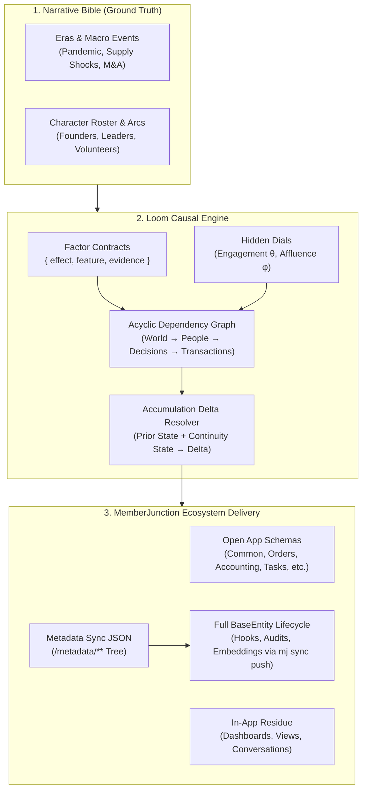

# 🧵 Loom

> **Deterministic, Causal Business World & Data Simulation Engine for MemberJunction**
> 
> *Loom weaves together narrative threads, causal factor dials, and relational records into an unbroken, living operational fabric.*

[](https://github.com/MemberJunction/MJ)
[](LICENSE)
[]()

---

## 🧭 Why Loom Exists

Enterprise application demos and integration test fixtures almost always fail the **realism test**. 

Standard synthetic data generators fill tables with independent statistical draws: names from one list, addresses from another, order amounts from a normal distribution, and churn dates rolled on independent dice. The resulting records might satisfy schema constraints, but they collapse under scrutiny:
- Street names that don't exist in the listed country
- Order renewals that don't correlate with customer engagement
- Tickets and dispute conversations occurring simultaneously with payments
- Zero accumulated operational residue (no audit trails, saved views, or shared history)
- Full-database wipe-and-reseed cycles that break downstream references and produce unmanageable 100MB+ migration files

**Real data realism is a property of causality, correlation, and continuous accumulation.**

Loom is built on a different paradigm: **Causality first, not sampling.**

In Loom, observable facts are never generated in isolation. Every row, transaction, and event descends from underlying causal dials (such as customer engagement $\theta$, affluence $\phi$, and macroeconomic shifts) through explicitly declared factor graphs. Furthermore, Loom models organizations that **accumulate living history over time** rather than regenerating from scratch.

---

## ⚡ Core Architectural Pillars



### 1. Narrative-Driven Ground Truth
Loom follows the **Disney Principle**: the story comes first, and the data is generated *from* it.
- A versioned narrative bible defines founding stories, leadership eras, historical crises, and character arcs.
- The narrative sets the boundary conditions and macroeconomic dials for generation. If the story states that an industry shock crippled wholesale orders while boosting direct-to-consumer sales in 2020, the generated transactional data reflects that exact inflection.

### 2. First-Class Accumulation (Never Wipe, Always Advance)
Real businesses do not drop their database and re-seed every quarter; they accumulate operational history.
- Loom is stateful: `(project, seed, releaseDate, ruleset, priorState) → deltaRecords`.
- Each simulation cycle reads the committed prior state, respects continuity boundaries (active terms, open support tickets, pending renewals), and emits **only new records** into the metadata tree.
- Prior IDs remain permanently stable across accumulation cycles.

### 3. Sole Delivery Invariant: Exclusive Metadata Ingestion (BaseEntity Lifecycle)
Loom enforces an absolute architectural invariant: **Metadata is the sole, exclusive engine for synthetic data delivery.**
- All simulated records are emitted as declarative MemberJunction metadata trees (`metadata/` JSON format) and ingested via `mj sync push`.
- **Zero Direct-SQL Bypasses**: Direct SQL migrations (`INSERT INTO ...`) for transactional data are strictly prohibited. In MemberJunction, operational integrity relies on strongly typed `BaseEntity` subclasses (`Record.Save()`), which execute server-side validation rules, permission checks, custom lifecycle overrides, status transitions, vector embeddings, and audit trails. Bypassing `BaseEntity` via direct SQL produces silent corruption and breaks platform guarantees. Every synthetic record in Loom executes the exact same pipeline as live production user activity.

### 4. Fully Metadata- & Configuration-Driven
- The Loom engine contains **zero hardcoded domain procedures**.
- Domain schemas, entity graphs, relational references, and factor dependencies are authored in declarative JSON metadata and validated against strict Zod contracts.
- Expanding to a new business domain requires authoring declarative configs, not editing engine source code.

### 5. Deterministic Identity & Byte-Level Reproducibility
- Every record's primary key is generated deterministically via `uuidv5(namespace, "entity:businessKey")`.
- Identical configuration + identical seed = byte-identical output across runs, machines, and architectures.
- Prior IDs remain permanently stable across accumulation cycles.

### 5. Bidirectional Factor Contracts & Verification
- Causal relationships are declared as factor contracts: `{ effect, feature, evidence }`.
- **Declaring earns you checks**: during generation, the factor executes forward to draw correlated distributions; during validation, the suite executes backward to verify that the generated data adheres to statistical and referential tolerance bands.
- 300+ validation gates catch referential closure, demographic alignment, and logical contradictions.

### 6. Native Open App & BizApps Composition
Loom is designed from the ground up for the [MemberJunction Open App](https://github.com/MemberJunction/MJ/tree/main/packages/OpenApp) architecture:
- **`bizapps-common`**: Master identity graph (`Person`, `Organization`, `Address`, `ContactMethod`, `Activity`).
- **`bizapps-orders`**: Commercial billing substrate, product catalog, orders, subscriptions, and dues renewals.
- **`bizapps-accounting`**: Balanced subsidiary ledger, automated per-line journal entries (`SUM(Debits) === SUM(Credits)`), and ratable revenue recognition.
- **`bizapps-sales` & `bizapps-contracts`**: Deals, pipelines, Closed Won orchestration, and legal provisions.
- **`bizapps-tasks` & `bizapps-issues`**: Workflows, approval gates, action items, and support tickets.
- **`bizapps-secure-messaging`**: Customer portal communications and threaded support dialogues.
- **`bizapps-sonar`**: Data health scoring, anomaly monitoring, and quality rule evaluation.

---

## 🛠️ Monorepo Structure

```
loom/
├── packages/
│   ├── engine/           # Core causal graph resolver, factor runner, and accumulator
│   ├── contracts/        # Declarative schema contracts, factor interfaces, and Zod schemas
│   ├── cli/              # The `loom` command-line tool
│   └── agent-skill/      # Autonomous Agent Skill for weekly accumulation and Playwright verification
├── projects/
│   ├── fixture/          # Lightweight CI testbed project (~120 lines, verified every build)
│   └── [consumers]       # External consumers (e.g. More Cheese) load as standalone projects
├── docs/                 # Architectural specifications, factor guide, and authoring handbook
├── plans/                # Active implementation briefs and design roadmap
├── package.json          # pnpm monorepo workspace configuration
├── turbo.json            # Turborepo task pipeline
└── tsconfig.json         # Strict TypeScript configuration
```

---

## 🚀 The Loom CLI

Loom provides an ergonomic, scriptable CLI designed for both human engineers and autonomous coding agents:

```bash
# Generate complete world baseline from declarative metadata
loom build --project=morecheese --seed=42 --release=2026-09-01

# Advance simulation by one cycle (Accumulation mode)
loom accumulate --project=morecheese --prior-state=./metadata --weeks=1

# Execute 300+ statistical, referential, and factor verification gates
loom validate --project=morecheese

# Inspect causal graph and factor dependencies
loom inspect factors --project=morecheese

# Emit delta metadata sync JSON and versioned Skyway migrations
loom emit migrations --output=./migrations
```

---

## 🤖 The Simulation Agent Skill & Visual Invariants

Loom includes an autonomous **Agent Skill** designed to run recurring weekly simulation cycles:
1. **Story Evolution:** Extends the narrative bible and folds in current events.
2. **Rules Update:** Translates narrative developments into declarative factor configs.
3. **Accumulation Run:** Invokes `loom accumulate` to generate pure deltas.
4. **Automated Gates:** Executes deterministic and statistical validation gates.
5. **Playwright Visual Verification:** Boots the local host stack (`MJAPI` + `MJExplorer`) and drives headless browser sessions to inspect rendered dashboards, verify persona views (CEO, VP Membership), and guarantee zero UI or GraphQL runtime regressions before committing the state.

---

## 🤝 Part of the MemberJunction Ecosystem

| Tool | Focus | Role in Ecosystem |
|---|---|---|
| **`Loom`** | Data & World Simulation | Weaves causal, deterministic enterprise data and living operational history |
| **`Skyway`** | Database Migrations | TypeScript-native, multi-dialect migration engine (SQL Server & PostgreSQL) managing schema DDL, versioning, and transactional execution |
| **`Forge`** | Database Administration IDE | AI-native SQL Server & database administration client for macOS and Windows — query, explore, visualize, and manage data |
| **`Sonar`** | Engagement Scoring & Data Quality | Declarative engagement scoring, health monitoring, and anomaly detection across entities with explainable factor rubrics |

---

## 📄 License

Loom is source-available software licensed under the [Business Source License 1.1 (BUSL-1.1)](LICENSE).
