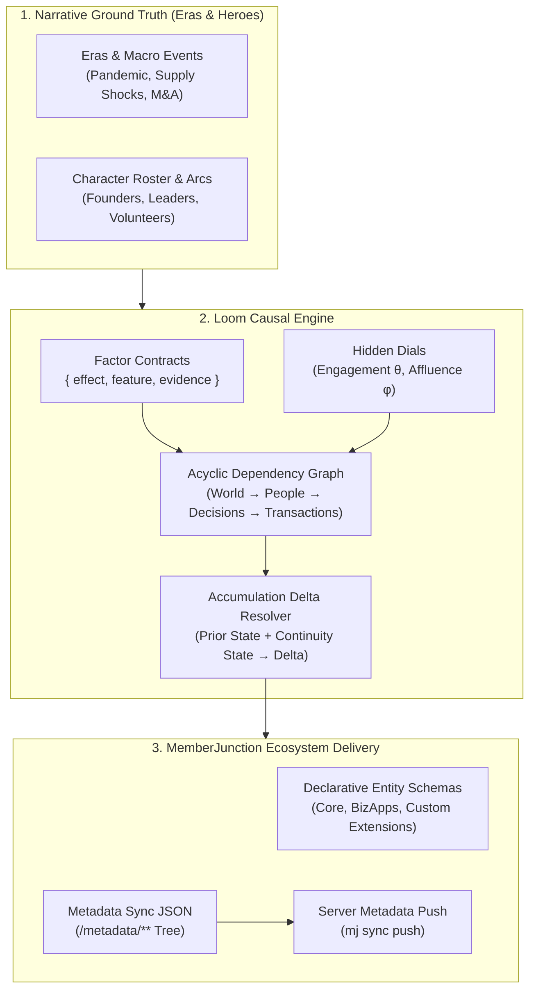

# 🧵 Loom

> **Deterministic, Causal Business World & Data Simulation Engine for MemberJunction**
> 
> *Loom weaves together narrative threads, causal factor dials, and relational records into an unbroken, living operational fabric.*

[](https://github.com/MemberJunction/MJ)
[](LICENSE)
[]()

---

## 🧭 Why Loom Exists

Enterprise application demos and integration test fixtures almost always fail the **realism test**. 

Standard synthetic data generators fill tables with independent statistical draws: names from one list, addresses from another, order amounts from a normal distribution, and churn dates rolled on independent dice. The resulting records might satisfy schema constraints, but they collapse under scrutiny:
- Street names that don't exist in the listed country
- Order renewals that don't correlate with customer engagement
- Tickets and dispute conversations occurring simultaneously with payments
- Zero accumulated operational residue (no audit trails, saved views, or shared history)
- Full-database wipe-and-reseed cycles that break downstream references and produce unmanageable 100MB+ migration files

**Real data realism is a property of causality, correlation, and continuous accumulation.**

Loom is built on a different paradigm: **Causality first, not sampling.**

In Loom, observable facts are never generated in isolation. Every row, transaction, and event descends from underlying causal dials (such as customer engagement $\theta$, affluence $\phi$, and macroeconomic shifts) through explicitly declared factor graphs. Furthermore, Loom models organizations that **accumulate living history over time** rather than regenerating from scratch.

---

## ⚡ Core Architectural Pillars



### 1. Narrative-Driven Ground Truth
Loom follows the **Disney Principle**: the world is grounded in explicit narrative boundary conditions rather than unseeded dice.
- Authored era manifests (`eras.json`) define macroeconomic shifts, industry shocks, and temporal multipliers across historical cycles.
- Authored hero configurations (`heroes.json`) anchor key characters with deterministic business keys, state ladders, and pinned outcomes.
- The narrative sets the boundary conditions and macroeconomic dials for generation. If the story states that an industry shock crippled wholesale orders while boosting direct-to-consumer sales in 2020, the generated transactional data reflects that exact inflection.

### 2. First-Class Accumulation (Never Wipe, Always Advance)
Real businesses do not drop their database and re-seed every quarter; they accumulate operational history.
- Loom is stateful: `(project, seed, releaseDate, ruleset, priorState) → deltaRecords`.
- Each simulation cycle reads the committed prior state, respects continuity boundaries (active terms, open support tickets, pending renewals), and emits **only new records** into the metadata tree.
- Prior IDs remain permanently stable across accumulation cycles.

### 3. Sole Delivery Invariant: Exclusive Metadata Ingestion
Loom enforces an absolute architectural invariant: **Metadata is the sole, exclusive engine for synthetic data delivery.**
- All simulated records are emitted as declarative MemberJunction metadata trees (`metadata/` JSON format) and ingested via `mj sync push`.
- **Zero Direct-SQL Bypasses**: Direct transactional SQL execution for synthetic data delivery is strictly prohibited. Synthetic data delivery flows through declarative metadata files ingested through MemberJunction server metadata APIs (`mj sync push`).

### 4. Fully Metadata- & Configuration-Driven
- The Loom engine contains **zero hardcoded domain procedures**.
- Domain schemas, entity graphs, relational references, and factor dependencies are authored in declarative JSON metadata and validated against strict Zod contracts.
- Expanding to a new business domain requires authoring declarative configs, not editing engine source code.

### 5. Deterministic Identity & Byte-Level Reproducibility
- Every record's primary key is generated deterministically via `uuidv5(namespace, "entity:businessKey")`.
- Identical configuration + identical seed = byte-identical output across runs, machines, and architectures.
- Prior IDs remain permanently stable across accumulation cycles.

### 6. Bidirectional Factor Contracts & Verification
- Causal relationships are declared as factor contracts: `{ effect, feature, evidence }`.
- **Declaring earns you checks**: during generation, the factor executes forward to draw correlated distributions; during validation, the suite executes backward to verify that the generated data adheres to statistical and referential tolerance bands.
- Automated validation gates evaluate referential closure, schema constraints, era volume multipliers, hero pins, and factor tolerance bands across the entire generated dataset.

### 7. Schema-Agnostic Open App & Ecosystem Compatibility
Loom is fully schema-agnostic and generates data for any MemberJunction domain model:
- Works with any entity shape, primary key type, foreign key relationship, and business key structure.
- Natively models standard MemberJunction Open App architectures, including core CRM, commerce, accounting, governance, and custom downstream extensions.
- Enforces strict foreign key closure and topological ordering across all dependent schemas.

---

## 🛠️ Monorepo Structure

```
loom/
├── packages/
│   ├── engine/           # Core causal graph resolver, factor runner, and accumulator
│   ├── contracts/        # Declarative schema contracts, factor interfaces, and Zod schemas
│   ├── cli/              # The `loom` command-line tool
│   └── agent-skill/      # Autonomous Agent Skill for weekly accumulation, push, and Playwright verification
├── projects/
│   ├── fixture/              # Lightweight CI testbed project (~120 lines, verified every build)
│   ├── enterprise/           # Reference enterprise SaaS simulation project
│   └── governance-fixture/   # Generic governance and temporal scoping fixture
├── plans/                # Active implementation briefs and design roadmap
├── package.json          # pnpm monorepo workspace configuration
├── turbo.json            # Turborepo task pipeline
└── tsconfig.json         # Strict TypeScript configuration
```

---

## 🚀 The Loom CLI

Loom provides an ergonomic, scriptable CLI designed for both human engineers and autonomous coding agents:

```bash
# Generate complete world baseline from declarative metadata
loom build --project=projects/enterprise --seed=42 --release=2026-09-02

# Advance simulation by one cycle (Accumulation mode)
loom accumulate --project=projects/enterprise --prior-state=./metadata --cycles=1

# Execute statistical, referential, and factor verification gates
loom validate --project=projects/enterprise
```

---

## 🤖 The Simulation Agent Skill Workflow

Loom's autonomous Agent Skill executes recurring simulation cycles against running hosts:
1. **Accumulate:** Invokes `loom accumulate --cycles <n>` to generate pure deltas from committed prior state.
2. **Validate:** Executes deterministic referential closure, hero pins, and factor tolerance gates (`loom validate`).
3. **Ingestion:** Pushes generated metadata deltas via `mj sync push --dir <generated>` through server metadata APIs.
4. **Visual Inspection:** Drives headless Playwright browser sessions to inspect rendered views and verify zero UI, GraphQL, or data regressions before merging.

### Test Execution Matrix (Mock vs Live)

To ensure fast, hermetic, and deterministic CI execution without external network or browser dependencies, unit tests configure specific boundaries:

| Subsystem | Live Execution | Unit Test / CI Execution | Rationale |
| :--- | :--- | :--- | :--- |
| **`accumulate`** | **LIVE** | **LIVE** | Executes actual `executeAccumulate` CLI/engine logic, computing diffs and persisting checkpoint files to disk. |
| **`validate`** | **LIVE** | **LIVE** | Executes full `executeValidate` engine logic against real serialized files, examining all referential, factor, and relational gates. |
| **`push`** | **LIVE** (`mj sync push`) | **STUBBED** (`executePush` callback) | Avoids requiring a running MJAPI backend during test runs; records command lines and verifies strict fail-stop invocation order. |
| **`playwright`** | **LIVE** (Chromium browser launch) | **MOCKED** (`vi.mock('playwright')`) | Avoids requiring local browser binaries and display servers during automated test runs; verifies route navigation and error handling. |

*See [`packages/agent-skill/README.md`](packages/agent-skill/README.md) for full details on error-abort semantics and test suites.*

---

## 🤝 Part of the MemberJunction Ecosystem

| Tool | Focus | Role in Ecosystem |
|---|---|---|
| **`Loom`** | Data & World Simulation | Weaves causal, deterministic enterprise data and living operational history |
| **`MetadataSync`** | Declarative Data Sync | Bidirectional declarative metadata and seed synchronization for MemberJunction |
| **`Forge`** | Database Administration IDE | AI-native SQL Server & database administration client for macOS and Windows — query, explore, visualize, and manage data |
| **`Sonar`** | Engagement Scoring & Data Quality | Declarative engagement scoring, health monitoring, and anomaly detection across entities with explainable factor rubrics |

---

## 📄 License

Loom is source-available software licensed under the [Business Source License 1.1 (BUSL-1.1)](LICENSE).
