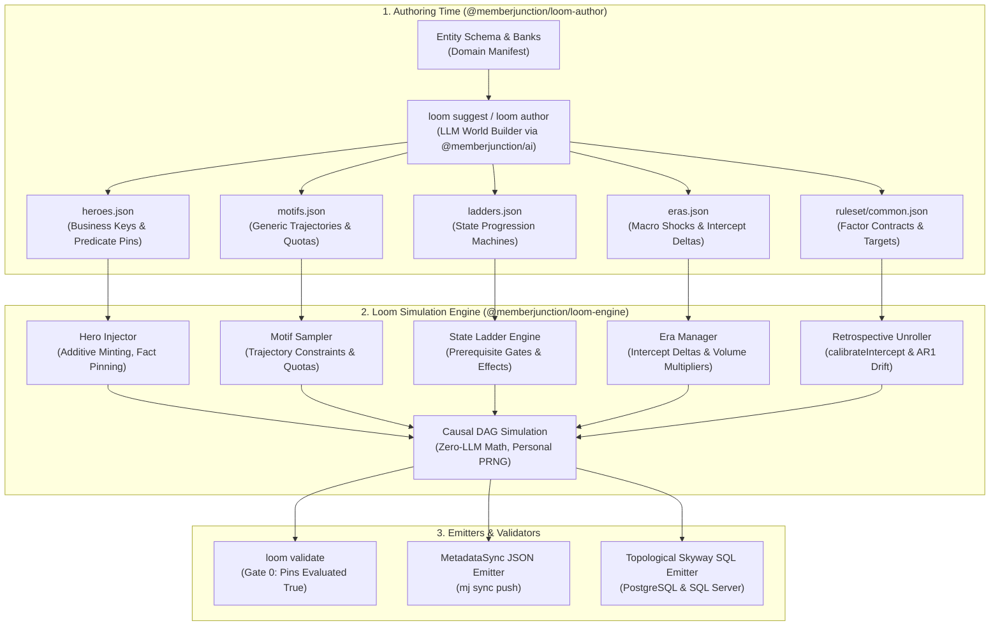

# Loom Plan 02: Schema-Agnostic Hero Personas, Motifs, State Progression Ladders & Retrospective Simulation

**Universal Metadata-Driven World Modeling for MemberJunction**

Version 2.0 · September 2026  
Status: Proposed (Round 1 Review Incorporated)  
Target Repository: `MemberJunction/loom`  
Flagship Consumer: `MemberJunction/more-cheese`  
Companion PR: [MemberJunction/more-cheese#20](https://github.com/MemberJunction/more-cheese/pull/20)

---

## 1. Executive Summary & Core Invariants

### 1.1 The Challenge
To deliver compelling demonstrations and robust analytical/AI training sets, business data simulations require two distinct operational modes:
1. **Scriptable Predictability ("Hero Personas")**: A demonstration narrative requires specific individuals with guaranteed storylines (e.g., a board chair rising through the ranks, a customer churning following an employer shutdown, a practitioner mid-way through a multi-tier credential, or an account in a 14-day renewal grace window). These records cannot be left to unseeded or random rolls.
2. **Emergent Macro Distribution ("The Calibrated Crowd")**: Around the heroes, thousands of background records must exhibit realistic macroeconomic behavior over multi-cycle history (e.g., an intake curve, calibrated retention targets, tenure curves, churn shocks during external macro events, and authentic reactivation rates).

### 1.2 The Absolute Engine Boundary: 100% Schema-Agnostic
Loom must **never** hardcode domain vocabulary ("Board of Directors", "Cheesemaker", "Course Enrollment", "Churn", "Joins") into its engine code. Loom is an enterprise world simulator for **any database schema of any shape for any application** in the MemberJunction ecosystem.

> **The Enterprise Test**: Every contract key defined in this plan must be authorable by `projects/enterprise` (`Company`, `Product`, `Member`, `Subscription`, `OrderHeader`, `OrderLine`, `Payment`) without renaming a single key. Domain vocabulary appears strictly as **values** in a consumer's authored JSON, never as **keys** in Loom's Zod schemas.

### 1.3 Loom Engine Invariants
The simulation engine strictly adheres to the following foundational invariants:
- **Invariant 1 (Deterministic Identity)**: Primary keys are always derived deterministically via `IdentityService.MintId(domain, entity, businessKeys)` (uuidv5). Same business key values always yield the exact same UUID across all cycles and seeds.
- **Invariant 2 (No Unseeded Dice)**: Generation is 100% deterministic and reproducible. personal pseudo-random streams are keyed via `seed:entity:id:cycle`.
- **Invariant 3 (No Index Overwriting)**: Heroes are **additive** records minted from business keys, never index overwrites of crowd slots. Adding or removing a hero changes no other generated record in the dataset.
- **Invariant 4 (The LLM Boundary)**: Runtime simulation is strictly zero-LLM math. LLM capabilities are confined entirely to an authoring-time companion package (`@memberjunction/loom-author`) that outputs validated JSON metadata.
- **Invariant 5 (Deep Immutability)**: Emitted transaction history from earlier cycles is never mutated in subsequent cycles.
- **Invariant 7 (Factor Recovery)**: Statistical regression over emitted crowd data recovers authored $\beta$ weights within defined tolerance bounds ($\pm 0.15$ at $N \ge 5000$).

---

## 2. Declarative Metadata Contracts



---

## 3. Detailed Zod Contract Specifications

### 3.1 Hero Personas Contract (`heroes.json`)
Heroes do not carry hardcoded `primaryKey` values. They declare their business keys, and Loom mints their IDs. Their `pins` are checkable predicates over schema fields or named factor outcomes.

```json
{
  "$schema": "https://memberjunction.org/schemas/loom/heroes.v1.json",
  "heroes": [
    {
      "heroKey": "HERO-001",
      "entity": "Member",
      "businessKeys": {
        "Email": "elena.rodriguez@crowfeathercreamery.example.com"
      },
      "fixedFields": {
        "FirstName": "Elena",
        "LastName": "Rodriguez",
        "Title": "Head Cheesemaker",
        "CompanyID": "@lookup:Company:ORG-0042"
      },
      "birthCycle": 2021,
      "latentDials": {
        "theta": 1.8,
        "phi": 0.8
      },
      "ladderEntries": [
        {
          "ladderKey": "governance-ladder",
          "state": "CommitteeMember",
          "enterCycle": 2022,
          "exitCycle": 2024
        },
        {
          "ladderKey": "governance-ladder",
          "state": "BoardDirector",
          "enterCycle": 2024,
          "exitCycle": 2026
        }
      ],
      "pins": [
        {
          "kind": "field",
          "field": "Status",
          "op": "eq",
          "value": "Active"
        },
        {
          "kind": "outcome",
          "factor": "factor-membership-renewal",
          "cycle": 2025,
          "value": true
        }
      ]
    },
    {
      "heroKey": "HERO-002",
      "entity": "Member",
      "businessKeys": {
        "Email": "danielle.okafor@mistlebrook.example.com"
      },
      "fixedFields": {
        "FirstName": "Danielle",
        "LastName": "Okafor",
        "Title": "Dairy Operations Specialist",
        "CompanyID": "@lookup:Company:ORG-0089"
      },
      "birthCycle": 2022,
      "latentDials": {
        "theta": 0.2,
        "phi": -0.8
      },
      "eras": ["era-dairy-crisis-2025"],
      "pins": [
        {
          "kind": "field",
          "field": "Status",
          "op": "eq",
          "value": "Lapsed"
        },
        {
          "kind": "outcome",
          "factor": "factor-membership-renewal",
          "cycle": 2025,
          "value": false
        }
      ]
    }
  ]
}
```

### 3.2 Motifs Contract (`motifs.json`)
Motifs define parameterized trajectories and quotas stamped onto subsets of the crowd population:

```json
{
  "$schema": "https://memberjunction.org/schemas/loom/motifs.v1.json",
  "motifs": [
    {
      "motifKey": "leadership-growth-track",
      "targetEntity": "Member",
      "quota": { "mode": "count", "value": 16 },
      "birthCycles": [2018, 2019, 2020],
      "latentConstraints": {
        "theta": { "min": 1.2, "max": 2.2 },
        "phi": { "min": 0.2, "max": 1.5 }
      },
      "ladderProgression": {
        "ladderKey": "governance-ladder",
        "initialState": "CommitteeMember"
      }
    },
    {
      "motifKey": "rising-star-trajectory",
      "targetEntity": "Member",
      "quota": { "mode": "percentage", "value": 0.05, "rounding": "round" },
      "latentTrajectory": {
        "dial": "theta",
        "deltaPerCycle": 0.35
      },
      "childRates": [
        {
          "entity": "CourseEnrollment",
          "perCycle": { "min": 1, "max": 3 }
        }
      ]
    },
    {
      "motifKey": "corporate-ghost-autorenew",
      "targetEntity": "Member",
      "quota": { "mode": "count", "value": 25 },
      "latentConstraints": {
        "theta": { "min": -2.0, "max": -0.8 },
        "phi": { "min": 1.0, "max": 2.5 }
      },
      "fixedFields": {
        "AutoRenew": true
      },
      "factorOverrides": [
        {
          "factor": "factor-membership-renewal",
          "probability": 0.98
        }
      ]
    }
  ]
}
```

### 3.3 State Progression Ladders (`ladders.json`)
Ladders are generic Markov state machines. They bind either to a field on the entity or to child-entity records (such as committee membership or subscription terms):

```json
{
  "$schema": "https://memberjunction.org/schemas/loom/ladders.v1.json",
  "ladders": [
    {
      "ladderKey": "governance-ladder",
      "entity": "Member",
      "binding": {
        "mode": "childEntity",
        "childEntity": "CommitteeMembership",
        "foreignKey": "MemberID",
        "stateField": "Role",
        "termField": "TermCycle"
      },
      "cohortShare": 0.5,
      "states": [
        {
          "name": "CommitteeMember",
          "capacity": 60,
          "durationCycles": 2,
          "prerequisites": {
            "minCyclesSinceBirth": 1,
            "dials": { "theta": { "min": 0.8 } }
          },
          "effects": [
            { "factor": "factor-membership-renewal", "beta": 1.2 }
          ]
        },
        {
          "name": "BoardDirector",
          "capacity": 12,
          "durationCycles": 2,
          "prerequisites": {
            "priorState": "CommitteeMember",
            "dials": { "theta": { "min": 1.2 } }
          },
          "effects": [
            { "factor": "factor-membership-renewal", "beta": 3.0 }
          ]
        },
        {
          "name": "ChairElect",
          "capacity": 1,
          "durationCycles": 1,
          "prerequisites": {
            "priorState": "BoardDirector"
          },
          "effects": [
            { "factor": "factor-membership-renewal", "beta": 4.0 }
          ]
        },
        {
          "name": "BoardChair",
          "capacity": 1,
          "durationCycles": 2,
          "prerequisites": {
            "priorState": "ChairElect"
          },
          "effects": [
            { "factor": "factor-membership-renewal", "beta": 4.5 }
          ]
        },
        {
          "name": "ImmediatePastChair",
          "capacity": 1,
          "durationCycles": 2,
          "prerequisites": {
            "priorState": "BoardChair"
          },
          "effects": [
            { "factor": "factor-membership-renewal", "beta": 2.5 }
          ],
          "exitEffects": [
            { "dial": "theta", "delta": 0.5 }
          ]
        }
      ]
    }
  ]
}
```

### 3.4 Eras & Shocks Contract (`eras.json`)
Eras provide macroeconomic shifts applied to factor baseline intercepts and volume multipliers over specific cycle spans:

```json
{
  "$schema": "https://memberjunction.org/schemas/loom/eras.v1.json",
  "eras": [
    {
      "eraKey": "era-dairy-crisis-2025",
      "cycles": [2025],
      "factorAdjustments": [
        { "factor": "factor-membership-renewal", "deltaIntercept": -0.85 }
      ],
      "volumeMultipliers": [
        { "entity": "OrderHeader", "multiplier": 0.70 }
      ]
    }
  ]
}
```

---

## 4. Retrospective Multi-Cycle Simulation Engine

### 4.1 Cohort Intake & Yearly Lifecycle Unroll
The retrospective engine reconstructs operational history across $N$ historical cycles:
1. **Intake Distribution**: New entities are minted at each cycle $C$ according to an authored intake count $N(C)$.
2. **Latent Vector Wander (AR1 Drift)**:
   Reuses `LatentDialConfig.annualWanderStdDev` and the correlation matrix from `@memberjunction/loom-engine`:
   $$\theta_{i, c} = \rho \theta_{i, c-1} + \sqrt{1 - \rho^2} \epsilon_{i, c}, \quad \epsilon_{i, c} \sim \mathcal{N}(0, 1)$$
3. **Scoring Individual Candidates (The Boats)**:
   $$\text{Score}_{i, c} = \sum_k \beta_k X_{i, c, k} + \text{LadderEffects}_{i, c} + \text{EraDelta}_{c}$$
4. **Solving Baseline Intercept (The Tide)**:
   The engine reuses `calibrateIntercept(scores, targetRate)` (Newton-Raphson with bisection fallback) to determine intercept $B_c$ such that:
   $$\frac{1}{|S_c|} \sum_{i \in S_c} \sigma(\text{Score}_{i, c} + B_c) = \text{TargetRate}_c$$
5. **Texture Band Gate**:
   An explicit `texture` tolerance band $[\text{Rate}_{\min}, \text{Rate}_{\max}]$ ensures year-to-year macro outcomes wander naturally rather than forming a flat line.
6. **Reactivation Pool**:
   Lapsed records enter a dormant pool. Reactivation decisions are evaluated via an authored factor (e.g. `factor-reactivation`) conditioned on feature `{ from: 'self', field: 'dormantCycles' }`.

---

## 5. Authoring-Time AI Package (`@memberjunction/loom-author`)

### 5.1 Clean Package Architecture
- **Package Isolation**: Kept in `@memberjunction/loom-author`. Neither `@memberjunction/loom-engine` nor `@memberjunction/loom-cli` carry LLM dependencies.
- **Provider Abstraction**: Implements MemberJunction's native AI abstraction (`@memberjunction/ai`) rather than raw vendor SDKs.
- **Consumer Bank Inputs**: Cultural names, geographic coordinates, and catalogs are consumer-supplied data files loaded by the authoring tool, never bundled into Loom core.

### 5.2 CLI Workflow
```bash
loom-author suggest \
  --project ./data \
  --entity Member \
  --target heroes \
  --count 16 \
  --theme "Artisan producers, buyers, safety trainers, judges" \
  --out ./data/ruleset/heroes.json
```

---

## 6. Verification Gates & Execution Roadmap

### Automated Verification Gates
- **Gate 0 (Hero Pins Evaluated)**: Every `pins` entry in `heroes.json` must evaluate to `true` during `loom validate`, failing the build if false, reported per hero per pin.
- **Gate 1 (Hero Determinism)**: Hero records are 100% byte-identical across any random seed.
- **Gate 2 (Motif Quotas)**: Motif assignments match declared counts ($\pm 0$) and rounded percentages ($\pm 0$).
- **Gate 3 (State Ladder Integrity)**: Zero gaps, zero overlapping terms, and 100% prerequisite compliance across all ladder transitions.
- **Gate 4 (Factor Recovery)**: Statistical logistic regression over simulated history recovers authored $\beta$ weights within $\pm 0.15$ at $N \ge 5000$.
- **Gate 5 (Dual-Dialect SQL Migrations)**: [MERGED in PR 4] Topological table ordering and valid transaction blocks in PostgreSQL and SQL Server.
- **Gate 6 (Schema-Agnostic Enterprise Proof)**: `projects/enterprise` authors at least one hero, one motif, and one ladder with the exact same contracts, and passes all tests in CI.

---

### Implementation Phases (Roadmap Plan 02)
- **Phase 02.1**: Zod metadata schemas in `@memberjunction/loom-contracts` (`heroes.ts`, `motifs.ts`, `ladders.ts`, `eras.ts`).
- **Phase 02.2**: Engine execution modules (`HeroInjector`, `MotifSampler`, `StateLadderEngine`, `RetrospectiveUnroller`).
- **Phase 02.3**: Validation engine integration (`loom validate` Gate 0, Gate 2, Gate 3, Gate 4).
- **Phase 02.4**: Enterprise testbed expansion (`projects/enterprise` hero, motif, ladder integration test).
- **Phase 02.5**: Standalone authoring tooling package (`@memberjunction/loom-author` with `loom suggest`).
- **Phase 02.6**: Downstream integration and verification in `MemberJunction/more-cheese`.
