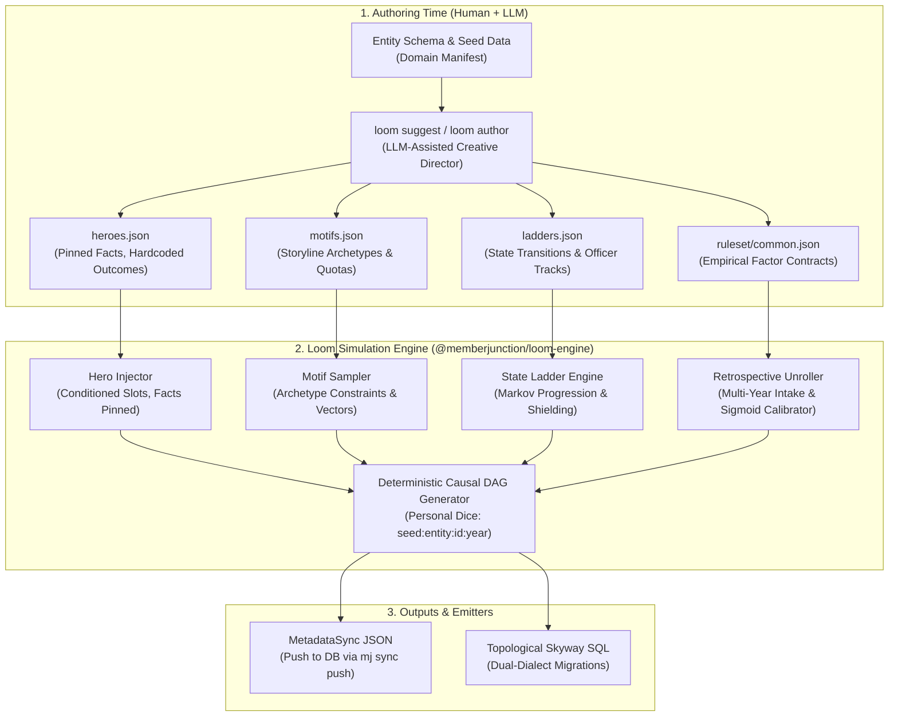
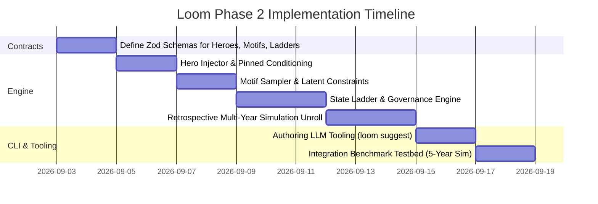

# Loom Phase 2: Schema-Agnostic Hero Personas, Motifs, Progression Ladders & Retrospective Simulation

**Universal Metadata-Driven World Modeling for MemberJunction**

Version 2.0 · September 2026  
Status: Approved Architectural Plan  
Target Repository: `MemberJunction/loom`  
Flagship Consumer: `MemberJunction/more-cheese`

---

## 1. Executive Summary & Problem Statement

### 1.1 The Challenge
To deliver compelling, sales-ready demonstrations and robust AI/analytical training sets, business data simulations require two conflicting properties:
1. **Scriptable Predictability ("Hero Personas")**: A demo narrative requires specific, known individuals with guaranteed storylines (e.g., the Board Chair who rose through the ranks, the loyal member who churned after an employer bankruptcy, the monger mid-way through a multi-tier certification, or the member in a 14-day renewal grace window). These records cannot be subject to random dice rolls.
2. **Emergent Macro Distribution ("The Calibrated Crowd")**: Around the heroes, thousands of background records must exhibit realistic macroeconomic textures over a multi-year history (e.g., a 5-year retrospective unroll with an intake curve, 87% retention, realistic board tenures, churn spikes during external shocks, and authentic reactivation rates).

### 1.2 The Core Architectural Constraint: 100% Schema Agnostic
Loom must **never** hardcode domain concepts ("Board of Directors", "Cheesemaker", "Course Enrollment", "Student") into its engine source code. Loom is an enterprise data engine built for **any database schema of any shape for any application** in the MemberJunction ecosystem.

All personas, motifs, officer ladders, transition matrices, and factor weights must be expressed as **declarative metadata JSON contracts**.

### 1.3 The LLM Boundary: Authoring Time vs. Runtime
- **Runtime (Forbidden)**: An LLM must **never** run inside the data generation or simulation execution loop. Runtime LLM calls introduce non-determinism, break byte-for-byte reproducibility (violating Loom Invariant 2), multiply generation latency from milliseconds to minutes, cost API tokens, and prevent idempotent database migrations.
- **Authoring Time (First-Class Feature)**: An LLM is an ideal **"World Builder / Creative Director"**. Loom provides an authoring tool (`loom suggest` / `loom author`) that inspects an arbitrary entity schema and existing data, and suggests rich, safety-cleared hero personas, story motifs, and factor contracts into editable JSON metadata files. Once authored, the deterministic math engine executes them with absolute precision.

---

## 2. Architecture & Metadata Specification



---

## 3. Declarative Metadata Contracts

### 3.1 Hero Personas Contract (`heroes.json`)
Heroes are **conditioned, not drawn**. A hero record specifies fixed attributes and pinned storyline outcomes that survive every seed, cycle, and scale.

```json
{
  "$schema": "https://memberjunction.org/schemas/loom/heroes.v1.json",
  "heroes": [
    {
      "heroKey": "HERO-001",
      "entity": "Person",
      "primaryKey": "E4D8F1E2-5A7C-4F9B-8D3E-2B1A0C9F8E01",
      "fixedFields": {
        "FirstName": "Elena",
        "LastName": "Rodriguez",
        "Email": "elena.rodriguez@crowfeathercreamery.example.com",
        "Title": "Head Cheesemaker"
      },
      "latentDials": {
        "theta": 1.8,
        "phi": 0.8
      },
      "pins": {
        "status": "Active",
        "minActivityPerYear": 3
      },
      "storyline": {
        "joins": { "year": 2021, "month": 3, "day": 15 },
        "roles": [
          { "ladderKey": "governance-ladder", "position": "CommitteeMember", "startYear": 2022, "endYear": 2024 },
          { "ladderKey": "governance-ladder", "position": "BoardDirector", "startYear": 2024, "endYear": 2026 }
        ]
      }
    },
    {
      "heroKey": "HERO-002",
      "entity": "Person",
      "primaryKey": "E4D8F1E2-5A7C-4F9B-8D3E-2B1A0C9F8E02",
      "fixedFields": {
        "FirstName": "Danielle",
        "LastName": "Okafor",
        "Title": "Dairy Operations Specialist"
      },
      "latentDials": {
        "theta": 0.2,
        "phi": -0.8
      },
      "pins": {
        "status": "Lapsed",
        "churnYear": 2025,
        "churnReason": "Employer Operations Ceased"
      },
      "storyline": {
        "joins": { "year": 2022, "month": 3, "day": 20 },
        "externalShock": { "year": 2025, "event": "EmployerDissolved" }
      }
    }
  ]
}
```

### 3.2 Motifs Contract (`motifs.json`)
Motifs are **parameterized story templates** stamped onto subsets of the crowd population to guarantee analytical depth:

```json
{
  "$schema": "https://memberjunction.org/schemas/loom/motifs.v1.json",
  "motifs": [
    {
      "motifKey": "board-leadership-track",
      "targetEntity": "Person",
      "quota": { "mode": "count", "value": 16 },
      "latentConstraints": {
        "theta": { "min": 1.2, "max": 2.2 },
        "phi": { "min": 0.2, "max": 1.5 }
      },
      "lifecycle": {
        "intakeYears": [2018, 2019, 2020],
        "stateLadder": "governance-ladder",
        "postServiceRetentionBonus": 0.65
      }
    },
    {
      "motifKey": "rising-star-upskill",
      "targetEntity": "Person",
      "quota": { "mode": "percentage", "value": 0.05 },
      "latentDrift": { "deltaThetaPerYear": 0.35 },
      "childInteractions": {
        "coursesPerYear": { "min": 1, "max": 3 },
        "credentialTarget": "Advanced"
      }
    },
    {
      "motifKey": "corporate-ghost-autorenew",
      "targetEntity": "Person",
      "quota": { "mode": "count", "value": 25 },
      "latentConstraints": {
        "theta": { "min": -2.0, "max": -0.8 },
        "phi": { "min": 1.0, "max": 2.5 }
      },
      "fixedFields": {
        "AutoRenew": true
      },
      "renewalShield": 0.98
    }
  ]
}
```

### 3.3 State Progression Ladders (`ladders.json`)
Expresses governance structures, committee hierarchies, certification tiers, or customer status progressions generically:

```json
{
  "$schema": "https://memberjunction.org/schemas/loom/ladders.v1.json",
  "ladders": [
    {
      "ladderKey": "governance-ladder",
      "contextEntity": "Person",
      "termMonths": 24,
      "staggeredElectionShare": 0.5,
      "stages": [
        {
          "position": "CommitteeMember",
          "prerequisites": { "minTenureMonths": 12, "minTheta": 0.8 },
          "capacity": 60,
          "renewalLiftBeta": 1.2
        },
        {
          "position": "BoardDirector",
          "prerequisites": { "priorPosition": "CommitteeMember", "minTheta": 1.2 },
          "capacity": 12,
          "renewalLiftBeta": 3.0
        },
        {
          "position": "ChairElect",
          "prerequisites": { "priorPosition": "BoardDirector" },
          "capacity": 1,
          "termMonths": 12,
          "renewalLiftBeta": 4.0
        },
        {
          "position": "BoardChair",
          "prerequisites": { "priorPosition": "ChairElect" },
          "capacity": 1,
          "termMonths": 24,
          "renewalLiftBeta": 4.5
        },
        {
          "position": "ImmediatePastChair",
          "prerequisites": { "priorPosition": "BoardChair" },
          "capacity": 1,
          "termMonths": 24,
          "renewalLiftBeta": 2.5,
          "alumniHaloTheta": 0.5
        }
      ]
    }
  ]
}
```

---

## 4. Retrospective Multi-Year Simulation Engine

### 4.1 Cohort Intake & Yearly Lifecycle Unroll
The simulation runs backward and forward across $N$ historical years (e.g. 2021–2026):
1. **Intake Distribution**: New members join each year according to an authored intake curve $N(y)$.
2. **Latent Vector Initialization & Drift**:
   $$\theta_{i, y} = \rho \theta_{i, y-1} + \sqrt{1 - \rho^2} \epsilon_{i, y}, \quad \epsilon_{i, y} \sim \mathcal{N}(0, 1)$$
3. **Scoring Decision (The Boats)**:
   $$\text{Score}_{i, y} = \beta_{\text{tenure}} Z(\text{tenure}_{i, y}) + \beta_\theta \theta_{i, y} + \beta_{\text{auto}} \mathbf{1}_{\text{auto}} + \sum_k \beta_k X_{i, y, k}$$
4. **Dynamic Sigmoid Baseline Calibration (The Tide)**:
   The engine numerically solves intercept $B_y$ via binary search:
   $$\frac{1}{|C_y|} \sum_{i \in C_y} \frac{1}{1 + e^{-(\text{Score}_{i, y} + B_y)}} = \text{TargetRate}_y$$
5. **Reactivation Pool**:
   Lapsed records transition to an inactive state pool. Each cycle, inactive records are evaluated for reactivation based on latent affinity and elapsed dormancy.

---

## 5. Authoring-Time AI Tooling (`loom suggest`)

### 5.1 CLI Workflow
Developers can prompt Loom's LLM engine to generate persona manifests from their entity schema:

```bash
loom suggest \
  --project ./data \
  --entity Person \
  --target heroes \
  --count 15 \
  --theme "Artisan creamery owners, mongers, sensory judges, and board leaders" \
  --out ./data/ruleset/heroes.json
```

### 5.2 Schema-Aware Suggestion Pipeline
1. Ingests `domain.json` (entity fields, types, foreign key relationships).
2. Generates culturally authentic names, valid geographic coordinates matching countries/regions, coherent titles, and plausible lifecycle stories.
3. Automatically formats output to the strict Zod `HeroConfig` and `MotifConfig` schemas.
4. Validates that all foreign key references align with name banks and catalog tables.

---

## 6. Implementation Phases & Verification Gates



### Verification Gates:
1. **Gate 1: Hero Invariance**: Verified hero records are 100% byte-identical across any random seed.
2. **Gate 2: Motif Quota Conformance**: Assert stamped motifs match declared counts and percentage quotas ($\pm 0\%$).
3. **Gate 3: Officer Transition Integrity**: Zero gaps, zero overlapping terms, and 100% adherence to ladder prerequisites.
4. **Gate 4: Retrospective Factor Recovery**: Churn model recovers authored $\beta$ weights from simulated 5-year history.
5. **Gate 5: Dual-Dialect Topological Emitter**: Generates valid, error-free migrations for PostgreSQL and SQL Server.
