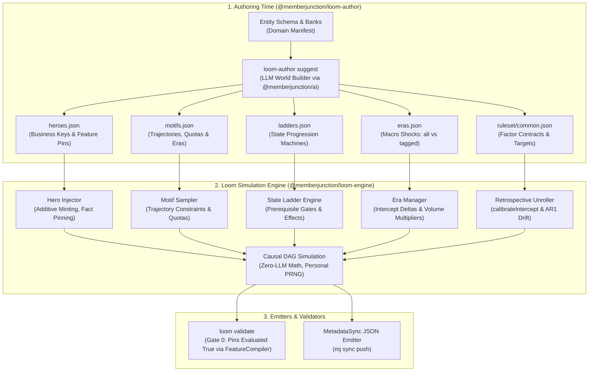

# Loom Plan 02: Schema-Agnostic Hero Personas, Motifs, State Progression Ladders & Retrospective Simulation

**Universal Metadata-Driven World Modeling for MemberJunction**

Version 2.0 · September 2026  
Status: Proposed (Round 3 Review Incorporated)  
Target Repository: `MemberJunction/loom`  
Flagship Consumer: `MemberJunction/more-cheese`  
Companion PR: [MemberJunction/more-cheese#20](https://github.com/MemberJunction/more-cheese/pull/20)

---

## 1. Executive Summary & Core Invariants

### 1.1 The Challenge
To deliver compelling demonstrations and robust analytical/AI training sets, business data simulations require two distinct operational modes:
1. **Scriptable Predictability ("Hero Personas")**: A demonstration narrative requires specific individuals with guaranteed storylines (e.g., an account executive rising through account tiers, a customer churning following a corporate restructuring, an account mid-way through an onboarding cycle, or an account in a renewal grace window). These records cannot be left to unseeded or random rolls.
2. **Emergent Macro Distribution ("The Calibrated Crowd")**: Around the heroes, thousands of background records must exhibit realistic macroeconomic behavior over multi-cycle history (e.g., an intake curve, calibrated retention targets, tenure curves, churn shocks during external macro events, and authentic reactivation rates).

### 1.2 The Absolute Engine Boundary: 100% Schema-Agnostic
Loom must **never** hardcode domain vocabulary ("Board of Directors", "Cheesemaker", "Course Enrollment", "Churn", "Joins") into its engine code. Loom is an enterprise world simulator for **any database schema of any shape for any application** in the MemberJunction ecosystem.

> **The Enterprise Test**: Every contract key defined in this plan must be authorable by `projects/enterprise` (`Company`, `Product`, `Member`, `Subscription`, `OrderHeader`, `OrderLine`, `Payment`) without renaming a single key. Domain vocabulary appears strictly as **values** in a consumer's authored JSON, never as **keys** in Loom's Zod schemas.

### 1.3 Loom Engine Invariants
The simulation engine strictly adheres to the canonical invariant list defined in Section 1.4 of the [Loom Architecture Roadmap](loom-architecture-and-implementation-plan.md):
- **Invariant 1 (Deterministic Identity)**: Primary keys are derived deterministically via `IdentityService.MintId(domain, entity, businessKeys)` (uuidv5). Identical business key values yield the exact same UUID across all cycles and seeds.
- **Invariant 2 (No Unseeded Dice)**: Generation is 100% deterministic and reproducible. Personal pseudo-random streams are keyed via `seed:entity:id:cycle`.
- **Invariant 3 (No Index Overwriting)**: Heroes are **additive** records minted from business keys, never index overwrites of crowd slots. Adding or removing a hero changes no other generated record in the dataset.
- **Invariant 4 (The LLM Boundary)**: Runtime simulation is strictly zero-LLM math. LLM capabilities are confined entirely to an authoring-time companion package (`@memberjunction/loom-author`) that outputs validated JSON metadata.
- **Invariant 5 (Deep Immutability)**: Emitted transaction history from earlier cycles is never mutated in subsequent cycles.
- **Invariant 6 (Factor Recovery)**: Statistical logistic regression over emitted crowd data recovers authored $\beta$ weights within defined tolerance bounds ($\pm 0.15$ at $N \ge 5000$).
- **Invariant 7 (Topological & Referential Closure)**: Emitted datasets strictly preserve foreign key closure in topological DAG dependency order with zero orphaned records.
- **Invariant 8 (Metadata Sole Delivery & BaseEntity Integrity)**: Metadata is the sole, exclusive engine for synthetic data delivery. All simulated records are emitted as partitioned declarative metadata files (`metadata/` tree) and ingested exclusively via MemberJunction's metadata sync push (`mj sync push`), ensuring every record triggers the complete `BaseEntity` subclass lifecycle, server hooks, validation rules, status transitions, vector embeddings, and audit tracking. Direct SQL `INSERT` bypasses are strictly prohibited.

---

## 2. Declarative Metadata Architecture



---

## 3. Detailed Zod Contract Specifications (Enterprise Testbed)

To guarantee compliance with the Enterprise Test, all examples below are written strictly against the benchmark schema in `projects/enterprise` (`Company`, `Product`, `Member`, `Subscription`, `OrderHeader`, `OrderLine`, `Payment`). These exact files will be committed under `projects/enterprise/ruleset/` in Phase 02.4.

### 3.1 Hero Personas Contract (`heroes.json`)
Heroes specify their entity, business keys, fixed fields, birth cycle, and checkable `pins`. 

**Conditioning vs. Constraint Semantics (L3)**:
- **Conditioning**: Outcome pins condition the latent state during retrospective simulation to guarantee consistent demo facts for hero records without relying on LLM authoring iterations; the emitted value is drawn and Gate 0 verifies it.
- **Empirical Gate 0 Verification**: During `loom validate`, Gate 0 verifies that the emitted dataset carries all pinned facts (catching emitter bugs, regressions, or pipeline mismatches). Field and feature pins are verified against realized records using `ValidateFieldPins` and `ValidateFeaturePins` / `compileRawFeature` without numeric coercion.

Pins support three kinds:
1. `kind: "field"`: Single field equality/comparison on the entity.
2. `kind: "outcome"`: Asserting the boolean result of a named factor contract in a cycle.
3. `kind: "feature"`: **Reuses Loom's `FeatureQuerySchema`** (`from`, `path`, `where`, `field`, `aggregation: count|sum|avg|min|max|exists`) evaluated via `compileFeature`. Supports operators: `eq`, `ne`, `neq`, `gt`, `gte`, `lt`, `lte`, `in`, `exists`, and `withinCyclesOfAsOf`.

```json
{
  "$schema": "https://memberjunction.org/schemas/loom/heroes.v1.json",
  "heroes": [
    {
      "heroKey": "HERO-ENT-001",
      "entity": "Member",
      "businessKeys": {
        "Email": "sarah.chen@acme-corp.example.com"
      },
      "fixedFields": {
        "FirstName": "Sarah",
        "LastName": "Chen",
        "Title": "VP of Operations",
        "CompanyID": "@lookup:Company:COMP-0001"
      },
      "birthCycle": 2021,
      "latentDials": {
        "theta": 1.8,
        "phi": 0.8
      },
      "ladderEntries": [
        {
          "ladderKey": "subscription-status-ladder",
          "state": "Active",
          "enterCycle": 2021,
          "exitCycle": 2025
        }
      ],
      "pins": [
        {
          "kind": "field",
          "field": "Title",
          "op": "eq",
          "value": "VP of Operations"
        },
        {
          "kind": "outcome",
          "factor": "factor-membership-renewal",
          "cycle": 2025,
          "value": true
        },
        {
          "kind": "feature",
          "feature": {
            "from": "OrderHeader",
            "where": { "Status": "Completed" },
            "aggregation": "count"
          },
          "op": "gte",
          "value": 2
        }
      ]
    },
    {
      "heroKey": "HERO-ENT-002",
      "entity": "Member",
      "businessKeys": {
        "Email": "david.ross@globex.example.com"
      },
      "fixedFields": {
        "FirstName": "David",
        "LastName": "Ross",
        "Title": "Procurement Lead",
        "CompanyID": "@lookup:Company:COMP-0002"
      },
      "birthCycle": 2022,
      "latentDials": {
        "theta": 0.2,
        "phi": -0.8
      },
      "eras": ["era-supply-disruption"],
      "pins": [
        {
          "kind": "outcome",
          "factor": "factor-membership-renewal",
          "cycle": 2023,
          "value": false
        },
        {
          "kind": "feature",
          "feature": {
            "from": "Subscription",
            "field": "EndDate"
          },
          "op": "withinCyclesOfAsOf",
          "value": [0, 1]
        }
      ]
    }
  ]
}
```

### 3.2 Motifs Contract (`motifs.json`)
Motifs specify quotas, birth cycles, latent trajectories (positive or negative wander), child interaction rates, and era participation:

```json
{
  "$schema": "https://memberjunction.org/schemas/loom/motifs.v1.json",
  "motifs": [
    {
      "motifKey": "enterprise-expansion-track",
      "targetEntity": "Member",
      "quota": { "mode": "count", "value": 16 },
      "birthCycles": [2021, 2022],
      "latentConstraints": {
        "theta": { "min": 1.2, "max": 2.2 },
        "phi": { "min": 0.2, "max": 1.5 }
      },
      "ladderProgression": {
        "ladderKey": "subscription-status-ladder",
        "initialState": "Trial"
      }
    },
    {
      "motifKey": "high-volume-buyer-trajectory",
      "targetEntity": "Member",
      "quota": { "mode": "percentage", "value": 0.05, "rounding": "round" },
      "latentTrajectory": {
        "dial": "theta",
        "deltaPerCycle": 0.35
      },
      "childRates": [
        {
          "entity": "OrderHeader",
          "perCycle": { "min": 2, "max": 6 }
        }
      ]
    },
    {
      "motifKey": "supply-casualty-churn",
      "targetEntity": "Member",
      "quota": { "mode": "count", "value": 25 },
      "eras": ["era-supply-disruption"],
      "latentTrajectory": {
        "dial": "theta",
        "deltaPerCycle": -0.40
      },
      "factorOverrides": [
        {
          "factor": "factor-membership-renewal",
          "probability": 0.05
        }
      ]
    }
  ]
}
```

### 3.3 State Progression Ladders (`ladders.json`)
Ladders model Markov state machines. They bind either directly to an entity field (e.g. `Company.Tier` or `Member.Status`) or to child-entity records (e.g. `Subscription.Status`):
- `cohortShare`: The fraction (0.0 to 1.0) of eligible cohort members who enter the initial state of the ladder upon meeting prerequisites.

```json
{
  "$schema": "https://memberjunction.org/schemas/loom/ladders.v1.json",
  "ladders": [
    {
      "ladderKey": "subscription-status-ladder",
      "entity": "Member",
      "binding": {
        "mode": "childEntity",
        "childEntity": "Subscription",
        "foreignKey": "MemberID",
        "stateField": "Status"
      },
      "cohortShare": 0.5,
      "states": [
        {
          "name": "Trial",
          "capacity": 200,
          "durationCycles": 1,
          "prerequisites": {
            "minCyclesSinceBirth": 0
          },
          "effects": [
            { "factor": "factor-membership-renewal", "beta": 0.5 }
          ]
        },
        {
          "name": "Active",
          "capacity": 100,
          "durationCycles": 4,
          "prerequisites": {
            "priorState": "Trial",
            "dials": { "theta": { "min": 0.5 } }
          },
          "effects": [
            { "factor": "factor-membership-renewal", "beta": 2.5 }
          ]
        },
        {
          "name": "PastDue",
          "capacity": 20,
          "durationCycles": 1,
          "prerequisites": {
            "priorState": "Active"
          },
          "effects": [
            { "factor": "factor-membership-renewal", "beta": -2.0 }
          ],
          "exitEffects": [
            { "dial": "theta", "delta": -0.3 }
          ]
        },
        {
          "name": "Cancelled",
          "capacity": 500,
          "durationCycles": 10,
          "prerequisites": {
            "priorState": "PastDue"
          },
          "effects": [
            { "factor": "factor-membership-renewal", "beta": -4.0 }
          ]
        }
      ]
    }
  ]
}
```

### 3.4 Eras & Shocks Contract (`eras.json`)
Eras provide macroeconomic shifts applied to factor baseline intercepts and volume multipliers over specific cycle spans. The `scope` determines applicability:
- `"all"`: Applies globally to all entities in the simulation during the active cycles.
- `"tagged"`: Applies only to entities tagged with the era key (either individually on a hero via `eras: ["..."]` or cohort-wide on a motif via `eras: ["..."]`).

```json
{
  "$schema": "https://memberjunction.org/schemas/loom/eras.v1.json",
  "eras": [
    {
      "eraKey": "era-recession-2023",
      "scope": "all",
      "cycles": [2023],
      "factorAdjustments": [
        { "factor": "factor-membership-renewal", "deltaIntercept": -0.85 }
      ],
      "volumeMultipliers": [
        { "entity": "OrderHeader", "multiplier": 0.70 }
      ]
    },
    {
      "eraKey": "era-supply-disruption",
      "scope": "tagged",
      "cycles": [2024],
      "factorAdjustments": [
        { "factor": "factor-membership-renewal", "deltaIntercept": -1.2 }
      ],
      "volumeMultipliers": [
        { "entity": "OrderHeader", "multiplier": 0.50 }
      ]
    }
  ]
}
```

---

## 4. Retrospective Multi-Cycle Simulation Engine

### 4.1 Cohort Intake & Yearly Lifecycle Unroll
The retrospective engine reconstructs operational history across $N$ historical cycles:
1. **Intake Distribution**: New entities are minted at each cycle $C$ according to an authored intake count $N(C)$.
2. **Latent Vector Wander (AR1 Drift)**:
   Reuses `LatentDialConfig.annualWanderStdDev` and the correlation matrix from `@memberjunction/loom-engine`:
   $$\theta_{i, c} = \rho \theta_{i, c-1} + \sqrt{1 - \rho^2} \epsilon_{i, c}, \quad \epsilon_{i, c} \sim \mathcal{N}(0, 1)$$
3. **Scoring Individual Candidates (The Boats)**:
   $$\text{Score}_{i, c} = \sum_k \beta_k X_{i, c, k} + \text{LadderEffects}_{i, c} + \text{EraDelta}_{c}$$
4. **Solving Baseline Intercept (The Tide)**:
   The engine reuses `calibrateIntercept(scores, targetRate)` (Newton-Raphson with bisection fallback) to determine intercept $B_c$ such that:
   $$\frac{1}{|S_c|} \sum_{i \in S_c} \sigma(\text{Score}_{i, c} + B_c) = \text{TargetRate}_c$$
5. **Reactivation Pool & Continuity Fields**:
   Lapsed records transition to a dormant pool. Reactivation decisions are evaluated via an authored factor (e.g. `factor-reactivation`). The feature grammar can reference a fixed set of **engine-maintained continuity fields** exposed by `ContinuityState`:
   - `birthCycle`: Cycle in which entity was minted.
   - `cyclesSinceBirth`: Total elapsed cycles since birth (`currentCycle - birthCycle`).
   - `dormantCycles`: Consecutive inactive cycles since last active state.
   - `currentLadderState`: The entity's active state in each bound ladder (or `null`).
   - `tenureInCurrentLadderState`: Consecutive cycles in the active ladder state.

---

## 5. Authoring-Time AI Package (`@memberjunction/loom-author`)

### 5.1 Clean Package Architecture
- **Package Isolation**: Kept strictly in `@memberjunction/loom-author`. Neither `@memberjunction/loom-engine` nor `@memberjunction/loom-cli` carry LLM dependencies.
- **Provider Abstraction**: Implements MemberJunction's native AI abstraction (`@memberjunction/ai`) rather than raw vendor SDKs.
- **Consumer Bank Inputs**: Cultural names, geographic coordinates, and catalogs are consumer-supplied data files loaded by the authoring tool, never bundled into Loom core.

### 5.2 CLI Workflow
```bash
loom-author suggest \
  --project ./projects/enterprise \
  --entity Member \
  --target heroes \
  --count 16 \
  --theme "B2B enterprise buyers, procurement managers, operations leads" \
  --out ./projects/enterprise/ruleset/heroes.json
```

---

## 6. Verification Gates & Execution Roadmap

### Automated Verification Gates
- **Gate 0 (Hero Pins Evaluated True)**: Every `pins` entry in `heroes.json` (field, outcome, and feature predicates) must evaluate to `true` during `loom validate` using `compileFeature`, failing the build if false, reported per hero per pin.
- **Gate 1 (Hero Determinism)**: Hero records are 100% byte-identical across any random seed.
- **Gate 2 (Motif Quotas)**: Motif assignments match declared counts ($\pm 0$) and rounded percentages ($\pm 0$).
- **Gate 3 (State Ladder Integrity)**: Zero gaps, zero overlapping terms, and 100% prerequisite compliance across all ladder transitions.
- **Gate 4 (Factor Recovery)**: Statistical logistic regression over simulated history recovers authored $\beta$ weights within $\pm 0.15$ at $N \ge 5000$.
- **Gate 5 (Metadata Sole Delivery & Ingestibility)**: Emitted metadata tree conforms strictly to MemberJunction `MetadataSync` expectations (`.mj-sync.json` per entity, `{ primaryKey, fields }` wrapped records, and zero SQL emission).
- **Gate 6 (Schema-Agnostic Enterprise Proof)**: `projects/enterprise` authors at least one hero, one motif, and one ladder with the exact same contracts, and passes all tests in CI.
- **Gate 7 (Texture Band)**: For each factor with a declared `texture` band $[R_{\min}, R_{\max}]$, the realized per-cycle rate must fall inside the band for every cycle and must exhibit non-zero variance (never a flat series).

---

## 7. Non-Goals for Plan 02

To preserve focus on delivering the core metadata contracts and retrospective simulation engine, the following capabilities are explicitly declared as non-goals for Plan 02:
1. **Scenarios (Parameter Overlays via `--scenario <key>`)**: Deferred to Plan 03. Plan 02 establishes the foundational persona, motif, ladder, and retrospective unroll simulation. Parameter overlays (e.g. `--scenario decliningOrg` overriding baseline factor weights and macro era multipliers) layer cleanly on top once the core contracts exist.
2. **Three Authoring Vocabularies (`liftPts` / `groupTarget` / `strength` compiled to $\beta$)**: Deferred to Plan 03 / `@memberjunction/loom-author`. Plan 02 standardizes on direct log-odds $\beta$ coefficients and target rates ($R_c$) calibrated via `calibrateIntercept`. High-level human unit compilation (`liftPts` $\to$ $\beta$) belongs in the authoring compiler layer.

---

### Implementation Phases & Task/Gate Mapping (Plan 02)

| Phase / Task | Finding Resolved | Scope & Deliverables | Verification Gate | PR |
|---|---|---|---|---|
| **Phase 02.1: Strict Schemas & Domain Validation** | L4a, N1, N2, N9 | `.strict()` on all Zod schemas (`heroes.ts`, `motifs.ts`, `ladders.ts`, `eras.ts`). Authored `validate*AgainstDomain` functions reporting unknown `entity.field` by name. Supported `ne` and `neq` (N1). Normalizes `fieldName = fieldName ?? fkKey` (N2). Percentage quotas as fraction $\in [0, 1]$. Dial arrows with strict union `DialArrowSchema \| FeatureArrowSchema` (N9). | Gate 0 / L4a suite: rejects unexpected keys, validates field existence, N9 dial arrow test. | `MemberJunction/loom#6` |
| **Phase 02.2: Unified Factor Engine & Retrospective Simulation** | L2, L3, L4b, L7, N3, R4-1, R3-2 | Composed `RetrospectiveUnroller` with `FactorEngine` profiles and `calibrateIntercept`. Absolute cycle convention (`[2021..2026]`). Scripted hero ladder transitions (`ForceTransition`/`ExitLadder`). Era conditioning on motif factor overrides. Single unified world unroller with `DomainConfig` foreignKey closure (R4-1). Hero `baseRow` overlay populating all schema columns (R3-2). Cites empirical measurements: at $N = 400$, $\beta = 1.2$ recovered within $\pm 0.08$; at $N = 5000$, $\beta = 0.50$ recovered at $0.485$ ($\Delta = 0.015 \le 0.15$). Factor gate $N$ floor established at $N \ge 250$ in enterprise simulation. | Gate 4: $\beta$ recovery $\pm 0.15$ at $N \ge 5000$. 400-person cohort test with $\beta = 6.0$. Invariant 3 byte-compare idempotency. | `MemberJunction/loom#6` |
| **Phase 02.3: CLI Generation Wiring & Continuity** | L1, R3-4, R5-4, Invariant 8 | `loom build` and `loom accumulate` run generation through `FactorEngine` + `RetrospectiveUnroller` + ruleset volumes. Continuity populated and asserted non-empty. Strict file reading throwing on corrupt checkpoint/metadata files with ENOENT-vs-parse discrimination (R5-4). Delta updates emit pure in-place metadata record diffs for status transitions (SQL UPDATE emission superseded by Invariant 8). | `integration-enterprise.test.ts`: non-empty continuity, Invariant 5 differential metadata loading, removing/altering factor alters distribution and fails gate. | `MemberJunction/loom#6` |
| **Phase 02.4: Validator Gate 0 & Empirical Factor Tolerance** | L3, L5, R3-1, R5-1, R6-3 | `Validator.Validate` implements Gate 0 evaluating all three pin kinds (field, outcome, feature via `compileRawFeature` without numeric coercion) per hero per pin. `executeValidate` in CLI passes loaded heroes and rejects empty datasets. Hero child feature pins generically conditioned in `build.ts` (R5-1). Factor tolerance reverted to 0.10 with $N \ge 250$ (R6-3). | `validator.test.ts`, `integration-enterprise.test.ts`: Gate 0 pass/fail tests, factor tolerance breach checks. | `MemberJunction/loom#6` |
| **Phase 02.5: Enterprise Fixtures & Dynamic Domain Vocabulary Gate** | L5, R3-3, R5-2, Gate 6 | Committed §3 enterprise fixtures (`heroes.json`, `motifs.json`, `ladders.json`, `eras.json`) under `projects/enterprise/ruleset/`. Added dynamic `scripts/check-domain-vocabulary.mjs` deriving domain words from ruleset files and checking whole-word boundaries with self-test (R5-2). | Gate 6: Enterprise 7-entity, 4-tier simulation passing 19 gates and 12-cycle accumulation. CI domain vocabulary grep passing with 'Cancelled' proof test. | `MemberJunction/loom#6` |
| **Phase 02.6: Flagship Consumer Schema & Conformance** | M1, M2, M5, R2-H1, R2-L1 | Real schema fields and business keys matching committed metadata in `more-cheese/data/domain.json`. Role catalog vocabulary (`Member`, `Vice Chair`, `Chair`) in ladders. Elena 2-term ladder match and Jamie null title match. Acceptance verified via `validate-loom-data.mjs` running against real Loom contracts with mutation testing. | `more-cheese#21` acceptance: `check-metadata-closure.mjs` (0 orphans across 177,518 FKs) + `validate-loom-data.mjs` mutation tests passing. | `MemberJunction/more-cheese#21` |
| **Phase 02.7: Multi-Cycle Child Row Generation from Motifs & Ladders (Deferred)** | Follow-up | Generate discrete child rows per cycle from `motif.childRates` and ladder bindings (`childRates[].fixedFields`). Enables child-aggregation feature pins across multi-cycle history. | Integration test verifying child row counts match rates per cycle. | Follow-up PR |
| **Phase 02.8: Single Cycle Unit & Manifest Typed Fields** | N6, R5-3, R5-5 | Single `cycleUnit` declared in `ProjectManifestSchema` (`year`, `week`, `month`, `cycle`) and used consistently by `build` and `accumulate` (N6, R5-5). Ladders advance only when whole cycle elapsed; `cyclesSinceBirth` calculated from `birthCycle`. `startCycle` and `releaseDate` typed required fields in manifest; all `as Record<string, unknown>` casts eliminated (R5-3). | `integration-enterprise.test.ts`: 12-cycle test asserts 5 status transitions matching `durationCycles` prediction; `startCycle: 2015` unrolls from 2015. | `MemberJunction/loom#6` |

