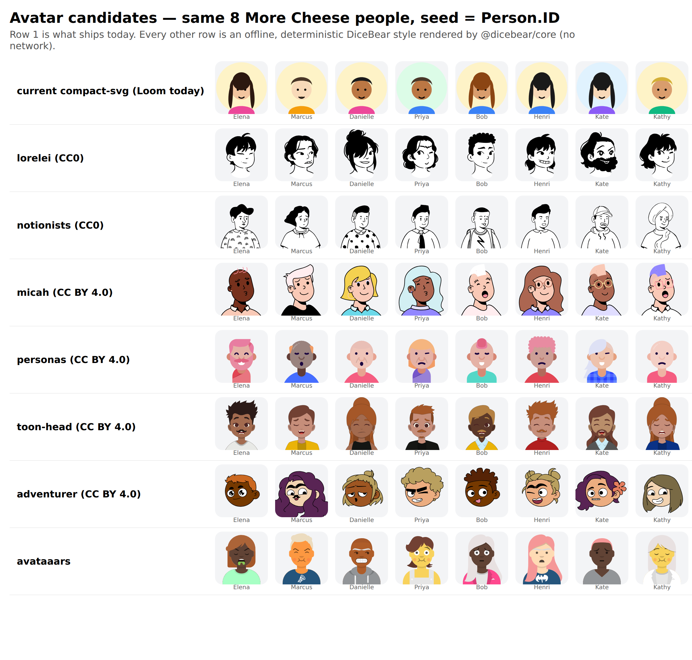

# Avatar Realism and Generation Follow-Ups (cheese #27 / loom #11 closure)

**Repository**: `MemberJunction/loom` (plan of record; implementation fans out to four repos)
**Status**: Plan for the builder. Owner-requested 2026-09-05 after cheese #27 merged.
**Reviewer**: the reviewer agent that signed off loom #11 and cheese #27 verifies every item below by running it.

---

## 0. Why this plan exists

Cheese #27 shipped with three logged, non-blocking follow-ups, and the owner added a fourth:

| # | Follow-up | Where it lives |
|---|---|---|
| F-A | Avatars are qualitatively poor ("icons"). The owner dislikes them. | loom `AvatarGenerator` + bizapps-common schema |
| F-B | `scripts/generate.mjs` hard-codes `641` organization logos. | more-cheese |
| F-C | 3,058 people share only 1,501 distinct `PhotoURL` values. | loom `AvatarGenerator` |
| F-D | MetadataSync SQL captures mint `@Field_<8 hex>` variable names from `uuidv4()`; two names collided across cheese's three sync files. | MJ `SQLServerDataProvider.RenderSaveCallBinding` |

Investigating F-A surfaced a fifth defect that becomes visible the moment avatars express gender:

| # | Follow-up | Where it lives |
|---|---|---|
| F-E | `Person.Gender` is assigned independently of `FirstName`. Of 355 people whose first name is on a common gendered-name list, 166 (47%) carry the opposite gender ("Bob / Female", "Danielle / Male"). | loom identity generation, cheese dataset |

Everything in §1 was measured on cheese `next` at `c173bc3` and loom `next` at `8b88a02` on 2026-09-05. The measurement scripts are described so the builder and reviewer can re-run them.

---

## 1. Findings, measured

### 1.1 F-A: the avatars look like icons because the column is 1,000 characters

`bizapps-common` declares both image fields as short strings:

```
migrations/B202602271452__v1.0.x_Schema_and_Tables.sql
  88:  PhotoURL NVARCHAR(1000),
 108:  LogoURL  NVARCHAR(1000),
```

Loom #11 honoured that ceiling by hand-drawing a ~450–570 byte SVG (`AvatarGenerator.BuildSvg`) that base64-encodes to 620–780 characters. Five background colours, five skin tones, five hair colours, five shirt colours, three hair shapes and an optional moustache is the entire expressive range. No amount of artistry fits an illustration in ~700 bytes. **F-A is a schema constraint, not a drawing problem.**

### 1.2 F-C follows directly from F-A

The hand-drawn generator's combinatorial space is small, so 3,058 unique `Person.ID` seeds collapse to 1,501 distinct outputs. Any illustrated style with a real part library makes this disappear (see the table in §1.3: every candidate except two novelty styles yields 3,058/3,058 distinct).

### 1.3 What real illustrated avatars cost

Measured with `@dicebear/core@9.4.2` and `@dicebear/collection@9.4.2` rendered **offline in Node** (no network) for all 3,058 cheese `Person.ID` seeds, minified with `svgo` (multipass), then wrapped as `data:image/svg+xml;base64,…`:

| Style | Avg base64 URI (chars) | Max | Distinct / 3,058 | Added to sync SQL | Art licence |
|---|---|---|---|---|---|
| **toon-head** | 6,836 | 11,238 | 3,058 | +20.9 MB | CC BY 4.0 (Johan Melin) |
| **micah** | 5,433 | 12,542 | 3,058 | +16.6 MB | CC BY 4.0 (Micah Lanier) |
| lorelei | 7,190 | 11,942 | 3,058 | +22.0 MB | CC0 (Lisa Wischofsky) |
| notionists | 17,354 | 40,190 | 3,058 | +53.1 MB | CC0 (Zoish) |
| personas | 3,981 | 8,470 | 3,058 | +12.2 MB | CC BY 4.0 (Draftbit) |
| adventurer | 10,894 | 25,882 | 3,058 | +33.3 MB | CC BY 4.0 (Lisa Wischofsky) |
| avataaars | 6,044 | 19,326 | 3,058 | +18.5 MB | "free for personal and commercial use" (Pablo Stanley) |
| open-peeps | 15,009 | 28,098 | 3,031 | +45.9 MB | CC BY 4.0 |
| thumbs | 1,114 | 1,390 | 3,058 | +3.4 MB | MIT/CC0 (DiceBear) |
| dylan | 3,020 | 5,918 | 2,101 | +9.2 MB | CC BY 4.0 |
| fun-emoji | 2,943 | 6,462 | 1,223 | +9.0 MB | CC BY 4.0 |

Code in every `@dicebear/*` package is MIT. The art licence is per style pack (its `LICENSE` file states both).

Side-by-side, same eight cheese people, seed = `Person.ID`, row 1 is what ships today:



### 1.4 F-B: a fixture count baked into a pipeline

`more-cheese/scripts/generate.mjs` lines 179–185:

```js
if (logoCount !== 641 || logoDistinct.size !== 641) { … process.exit(1); }
if (photoCount < 1) { … process.exit(1); }
```

The invariant is "every generated logo is distinct and at least one exists". The literal turns a legitimate population change into a pipeline failure, and `photoCount < 1` is the same check written so weakly it cannot catch a duplicate. Both belong in Loom's Validator as a gate, not in an app script.

### 1.5 F-D: birthday collisions in captured SQL

`MJ/packages/SQLServerDataProvider/src/SQLServerDataProvider.ts:1145`:

```ts
const uniqueSuffix = '_' + uuidv4().substring(0, 8).replace(/-/g, '');
```

Eight hex characters give 2³² names. Cheese's three sync files declare 120,616 `@Field_<suffix>` variables. Expected pairwise collisions at that count are n²/2·2³² ≈ 1.7; the reviewer observed 2. They are harmless today only because SQL Server variable scope ends at `GO` and each save block redeclares its variables, but the parity gate, the reviewer's independent check, and any future tooling that resolves `@ID_x` across a file all had to special-case it. The randomness also makes every recapture a 250 MB diff even when the tree did not change.

### 1.6 F-E: gender is drawn independently of name

Script: load `generated/people/*.json`, keep rows whose `Gender` is `Female` or `Male` and whose lowercase `FirstName` is on a fixed list of ~90 common gendered English/European first names, count mismatches. Result: 355 checked, 166 mismatched (47%), which is what independent draws produce. The current avatar hides this; an illustrated style with a gender trait will show "Bob" with long hair on every people grid.

---

## 2. Design it twice: where should a better avatar live?

| Option | What changes | Pros | Cons | Verdict |
|---|---|---|---|---|
| **A. Widen the columns, render offline, embed** | bizapps-common: `PhotoURL`, `LogoURL` → `NVARCHAR(MAX)`. Loom: `AvatarGenerator` becomes a thin deterministic adapter over `@dicebear/core` + declared style packs, svgo-minified, embedded as base64 data URI. | Real illustrations. Offline, deterministic, no runtime dependency. Additive schema change, allowed by the Publish-Then-No-Breaking-Changes policy. 3,058/3,058 distinct. | +17–22 MB of sync SQL (needs a fourth part or a rebalance). `generated/people` grows by ~20 MB of JSON. bizapps-common ships a migration. | **Recommended** |
| B. URL mode to `api.dicebear.com` | `format: url` (already exists in Loom). | ~120 chars, fits today's column. No schema change. | Third-party service in the render path of every demo. Offline demos show broken images. Seeds (synthetic GUIDs) leave the tenant. | Keep as opt-in, not default |
| C. Ship SVG files as package assets | Loom writes `assets/avatars/<id>.svg`; cheese's Angular package ships them; `PhotoURL` holds a relative URL. | Small columns, cacheable. | Open App install delivers migrations and npm packages only; the host Explorer would have to be configured to serve a package's assets. Couples data to a UI package and to host config. | Rejected |
| D. Keep 1,000 chars, draw better | More parts in `BuildSvg`. | No schema change. | ~700 bytes cannot hold an illustration. This is the option that produced F-A. | Rejected |

**Recommendation: Option A, default style `toon-head`, with `micah` as the documented alternate.** Both render all 3,058 people distinct at 5–7 KB, both read as people rather than glyphs (see the sheet), and both are CC BY 4.0, which costs one attribution line in the cheese README and the Loom NOTICE. If the owner prefers zero attribution obligations, `lorelei` (CC0, monochrome line art) is the fallback at the same size.

The owner picks the style; the plan does not. Everything below is style-agnostic.

---

## 3. Work packages

Order of landing: **WP3 (MJ) is independent and can land first**, because it makes cheese's recapture in WP4 byte-stable. **WP1 → WP2 → WP4** are sequential.

### WP1: bizapps-common, widen the image columns

- New V migration (not a baseline edit): `ALTER TABLE __mj_BizAppsCommon.Person ALTER COLUMN PhotoURL NVARCHAR(MAX) NULL;` and the same for `Organization.LogoURL`. Idempotent (`IF COL_LENGTH(...)`-style guard on the current max length).
- Extended-property descriptions updated to say the column may hold an inline data URI.
- CodeGen run, captured into the migration per bizapps-common conventions (`spCreate*`/`spUpdate*` parameter types and `EntityField.Length` regenerate; the view is unchanged).
- Changeset: `minor` (schema change).
- **Acceptance**: from-zero install on a private database, then `SELECT CHARACTER_MAXIMUM_LENGTH FROM INFORMATION_SCHEMA.COLUMNS WHERE TABLE_SCHEMA='__mj_BizAppsCommon' AND COLUMN_NAME IN ('PhotoURL','LogoURL')` returns `-1` for both; a `spUpdatePerson` with a 12 KB `PhotoURL` succeeds. Publish-no-break check: widening only.

### WP2: Loom, real avatars as a thin adapter, and the generator pass moves into the engine

**Dependencies.** `packages/engine` adds `@dicebear/core` (MIT) and, as regular dependencies, only the style packs Loom declares support for (start with `@dicebear/toon-head`, `@dicebear/micah`, `@dicebear/lorelei`; each is a separate MIT package carrying its own art licence). Add `svgo`. Loom's `NOTICE` (new file) lists each style pack's art licence and attribution verbatim from its `LICENSE`.

**Contract (`packages/contracts/src/domain.ts`).**

```ts
AvatarConfigSchema = z.object({
  style: z.enum(['toon-head', 'micah', 'lorelei']).default('toon-head'),
  format: z.enum(['base64', 'svg', 'url']).default('base64'),
  seedField: z.string().default('ID'),
  traitField: z.string().optional(),
  // trait value -> style option overrides, validated against the style's own JSON schema at compile time
  traits: z.record(z.record(z.unknown())).optional(),
  defaultTrait: z.string().optional(),
  options: z.record(z.unknown()).optional(),   // style options applied to every row
  maxLength: z.number().int().positive().optional(),
});
LogoConfigSchema adds the same maxLength.
```

`compact-svg`, `adventurer`, `avataaars`, `bottts`, `fun-emoji` leave the enum. Nothing on `next` other than cheese depends on them, and cheese re-pins in WP4.

**Engine (`packages/engine/src/avatars/AvatarGenerator.ts`).**

- `Generate(options)` renders `createAvatar(stylePack, { seed, ...options, ...traitOverrides })`, minifies with svgo (deterministic settings, `multipass: true`), and wraps per `format`. `format: url` keeps the existing DiceBear URL builder for the same style ids.
- `BuildSvg` (the hand-drawn generator) is deleted, not kept as a fallback. Less code is the design.
- `ResolveTrait` survives as the declarative mapping `traitField value → traits[value]` (a style-option object) with `defaultTrait` naming the fallback key. Unknown option keys or values are rejected against `stylePack.schema` when the domain compiles, so a typo in `traits` fails `loom build`, not a demo.
- `maxLength`: when set, a generated value longer than it throws with entity, field, seed and length in the message. When unset, no limit. Cheese sets none after WP1; the fixture project sets `maxLength: 1000` to prove the gate fires.
- Determinism: same `(style, seed, options)` → byte-identical output across processes. DiceBear seeds its PRNG from the seed string; svgo is deterministic; the test pins a checksum.

**The generator pass moves into the engine (closes F-B).**

- New `packages/engine/src/avatars/FieldGeneratorPass.ts`: `ApplyFieldGenerators(rows, entityCfg)` applies every `avatar` and `logo` field config to an array of MetadataSync records in place and returns `{ changed, generated: Map<field, count> }`. It is the single implementation; `packages/cli/src/generation.ts` calls it for freshly generated rows and a new CLI command `loom decorate <treeDir>` calls it for a committed tree. Cheese's copy of this logic is deleted in WP4.
- New Validator gate, one per avatar/logo field: `Generated Field Uniqueness: <Entity>.<Field>` passes only when every row has a value and `distinct === count`. This is the invariant `generate.mjs` was approximating with `641`. It is a gate, so it cannot be satisfied by a literal.

**Closes F-E in the same package.** `IdentityService` (or whichever module mints `FirstName`) owns `Gender`: names come from a gendered catalog and the row's `Gender` is derived from the catalog entry, with the declared non-binary / prefer-not-to-say / null shares applied afterwards as a deterministic overlay. A domain that declares `Gender` without `FirstName` on the same entity keeps the old independent draw. New Validator gate `Name–Gender Consistency: <Entity>` measures the mismatch rate on the gendered-catalog subset and fails above a declared tolerance (cheese declares 0%).

**Tests (`packages/engine/test/avatars.test.ts` rewritten, plus new files).** Each one must be shown failing against a deliberate mutation before it counts:

1. Determinism: two processes, same seed and style, identical base64; checksum pinned per style.
2. Distinctness: the 641-organization fixture and a new 3,058-ID people fixture (IDs only) render fully distinct for every enum style.
3. `maxLength` fires: `maxLength: 1000` with `toon-head` throws naming the seed.
4. Style schema rejection: `traits: { Female: { hairr: [...] } }` fails compile with the offending key.
5. Trait overrides change output and unmapped trait values fall back to `defaultTrait`.
6. `format: url` unchanged for every enum style.
7. `ApplyFieldGenerators` is idempotent: second application reports `changed: false`.
8. `Generated Field Uniqueness` gate fails when two rows share a seed value; passes on the fixture.
9. `Name–Gender Consistency` gate: fixture with independent draws fails; derived draws pass.
10. Existing 173 cheese gates still pass with the tree from WP4 (run by the reviewer, not by unit tests).

### WP3: MJ, deterministic variable suffixes in captured SQL (closes F-D)

`RenderSaveCallBinding` derives the suffix from the record, not from `uuidv4()`:

```
suffix = first 8 hex of sha1(`${entity.EntityInfo.SchemaName}.${entity.EntityInfo.BaseTable}|${pk values joined by '|'}`)
```

and disambiguates within a batch: the provider keeps a per-transaction-group `Map<suffix, n>` and appends `_2`, `_3` on repeats, so saving the same record twice in one batch still declares distinct variables. The name still matches `@[A-Za-z][A-Za-z0-9]*_[A-Za-z0-9]+`, so cheese's parity gate and the reviewer's scripts keep working unchanged.

Why hash rather than a counter: a counter is collision-free but shifts every later suffix when one record is inserted, turning a one-record change into a 250 MB diff. A PK hash gives a one-block diff. Why not the raw PK: a GUID is 32 hex characters and the suffix is appended to every field name in the block.

- Check `PostgreSQLDataProvider.RenderSaveCallBinding` for the same pattern and apply the same rule if present.
- Tests in `packages/SQLServerDataProvider/src/__tests__/save-delete-paths.test.ts`: same record → same suffix across two calls; different records → different suffixes; same record twice inside one transaction group → `_x` and `_x_2`; a 120,000-record synthetic run has zero duplicate declarations in a single batch.
- Acceptance the reviewer runs: `mj sync push --dir generated --ci` twice against two fresh private databases produces byte-identical captured SQL.

### WP4: More Cheese, adopt and prove

1. Bump the loom pin in `.github/workflows/changes.yml` and in the workspace link to the WP2 merge commit.
2. `data/domain.json`: `Person.PhotoURL.avatar` → `{ style: <owner's choice>, seedField: "ID", traitField: "Gender", traits: { … style options … }, defaultTrait: "…" }`. Remove `maxLength` (WP1 removed the ceiling). `Organization.LogoURL.logo` unchanged; the current `LogoGenerator` output is acceptable.
3. `scripts/generate.mjs` shrinks to: compile the domain, call `loom decorate generated` (or the engine `ApplyFieldGenerators`), verify checkpoint, verify porcelain. The `641` literal, `photoCount < 1`, and `applyConfiguredGenerators` are deleted.
4. Regenerate `Gender` consistent with `FirstName` (WP2's identity change) and regenerate `PhotoURL` for all 3,058 people. `generated/organizations` must not change.
5. Recapture MetadataSync on a fresh private database (never `bizapps_morecheese_20260903`). Budget: p03 is 73.7 MB today and gains ~21 MB, which crosses the 100 MB per-file limit only if the split is left alone; rebalance into `p01–p04` so every file stays under 100 MB. `check:sync-id-parity` must be 41/41 on the new capture, and with WP3 landed a second capture from the same tree must be byte-identical (`sha256sum migrations/V*MetadataSync*.sql`).
6. From-zero apply on a new private database; paste real output into the PR body. Row counts are unchanged from #27; only `PhotoURL` and `Gender` values change. Measure `SELECT COUNT(DISTINCT PhotoURL), COUNT(*) FROM __mj_BizAppsCommon.Person` → `3058, 3058`, and `SELECT MAX(LEN(PhotoURL))` under the measured max for the chosen style.
7. README: attribution line for the chosen style pack's art licence, verbatim from its `LICENSE`.
8. Changeset `minor` (migrations changed).

---

## 4. Reviewer acceptance (standing rules apply)

- Every claim in a PR body is re-run by the reviewer on a clean checkout. Counts are not a contract; the invariants in §3 are.
- Every new test is shown failing against a mutation before it is accepted (the builder posts the mutation and the failing output).
- No weakened assertions, no allowlists, no fallback that hides a failure. A gate that cannot fail is a defect.
- Fixture, calibration and gate changes are named in the commit message with the reason.
- The four repos land as four PRs referencing this plan: MJ (WP3), bizapps-common (WP1), loom (WP2), more-cheese (WP4). WP4's PR body carries the from-zero output and the byte-identical-recapture proof.
- Nothing merges without reviewer sign-off; nothing is merged by the builder or the reviewer.

## 5. Declined and deferred

- **Per-person photo realism (AI-generated faces)**: declined. Non-deterministic, licence-ambiguous, and a 3,058-image dependency in a migration.
- **Storing avatars through MJ Storage / File entities**: deferred. Correct for real tenants, wrong for a synthetic dataset whose sole delivery channel is a migration (Loom pillar 3).
- **Making `LogoGenerator` DiceBear-based too**: not needed. Logos are already 641/641 distinct and the owner raised no complaint; `LogoConfigSchema` only gains `maxLength`.
