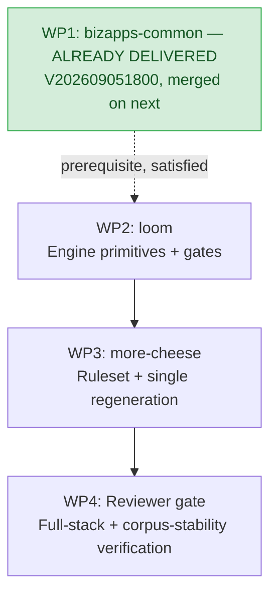

# Loom Plan 07: Correlated Value Generation, Coherent Order Reversals, and Avatar Strategy

**Repository**: `MemberJunction/loom` (Plan of Record)  
**Downstream Repositories**: `MemberJunction/more-cheese`, `MemberJunction/bizapps-common`  
**Status**: Proposal — reviewer revisions applied 2026-09-10  
**Target Milestone**: September 2026 Release Alignment  
**Supersedes / extends**: `plans/06-avatar-realism-and-generation-follow-ups.md` (see §1, *Relationship to Plan 06*)

---

> ### Reviewer revision note — 2026-09-10
>
> Revisions are marked inline as *(reviewer)*. Substance of the plan is kept; five things changed because they were measured against the current heads rather than assumed:
>
> 1. **WP1 is already delivered.** `bizapps-common` `V202609051800` widened `PhotoURL`/`LogoURL` to `NVARCHAR(MAX)` and is merged on `next`. WP1 no longer gates WP2. (§5)
> 2. **The `NVARCHAR(1000)` premise behind the avatar phasing is stale.** The shipped corpus already carries 3,058 `data:` URIs up to 9,862 chars. With that column equalised, the case for CDN URL mode has to be re-argued on payload size, not schema cost. (§1, §3.1, §3.3)
> 3. **Plan 06 already decided this**, via a design-it-twice that chose offline embedding. Plan 07 should extend it, not silently re-open it. (§1)
> 4. **Two gates could not fail as written** — avatar uniqueness is true by construction in URL mode, and the name/gender gate asserts an outcome real data does not satisfy. Both re-specified. (§4)
> 5. **A corpus-stability gate is added** and is the highest-value item here: this plan's changes move the deterministic draw, and WP3 regenerates the whole dataset. (§4.7)
>
> ### Owner decision — 2026-09-10
>
> **Avatars ship as inline base64 data URIs.** Chosen for portability and to avoid an external runtime dependency; the `NVARCHAR(MAX)` prerequisite is already merged, so there is nothing to defer. URL mode stays implemented and tested as a non-default option. §3 reflects this as settled, not as an open trade.

---

## 1. Executive Summary & Problem Statement

During full-scale validation of the 120,000-record `more-cheese` world model across the joined MemberJunction stack, four systemic data defects and visual constraints were identified:

1. **Gender / Name / Prefix / Pronoun Incoherence**:
   - `Person.Prefix` vs `Person.Gender` is a 51% coin flip (973 of 1,910 prefix assignments conflict with Gender, e.g. *"Mrs. Marcus Chen"*, *"Mr. Elena"*).
   - `MemberProfile.PronounSet` vs `Person.Gender` is a 50.8% coin flip (400 of 788 conflict, e.g. *"he/him"* on Female records).
   - `Person.FirstName` and `Person.Gender` are drawn independently, producing a 47% mismatch on gendered names.
2. **Independent Age / Join Date Draws**:
   - 48 members joined before age 18, with the youngest at age 9.5 (Nadia Ivanov, DOB 2003-11-01, joined 2013-05-10).
   - `DateOfBirth` was drawn independently of the entity's intake cycle / join date.
3. **Incoherent Order Cancellations & Sign Reversals**:
   - Out of 218 cancellations in the dataset, only 24 are coherent.
   - 114 share no products with what they reverse, 185 differ in amount, 23 reverse an order dated *after* the cancellation, 16 originals are reversed multiple times, 2 reverse someone else's order, and 6 reverse a Voided or Draft order.
   - Crucially, cancellations were generated with positive `TotalGross` and positive line quantities, adding +$52,310 to sales instead of netting them out.
4. **Avatar Visual Fidelity**:
   - The hand-drawn part library (`AvatarGenerator.BuildSvg`) produces winking expressions and unnatural hairstyles.
   - **Corrected 2026-09-10 (reviewer):** the 700-byte / `NVARCHAR(1000)` ceiling this section originally cited is **historical, not current**. Measured on merged `more-cheese` `next` (`86acb5b`):
     - `Person.PhotoURL`: **3,058 of 3,058 are `data:` URIs, max 9,862 chars — every one already exceeds 1,000.**
     - `Organization.LogoURL`: max 922 chars.
     - `bizapps-common` widened both columns to `NVARCHAR(MAX)` in `V202609051800__v5.39.x__Widen_PhotoURL_LogoURL.sql`, merged on `origin/next`. Its own header records the provenance: *"loom #12 WP1"*.
   - The earlier claim of "1,501 distinct avatars" is also stale — the current corpus reports 3,058 distinct `PhotoURL` values. Any distinctness figure quoted here must be re-measured against the head being planned from, not carried forward.

### Relationship to Plan 06 (read before implementing §3)

`plans/06-avatar-realism-and-generation-follow-ups.md` (2026-09-05) already covers the avatar half of this plan and **already ran a design-it-twice** on the exact question §3 re-opens. Plan 06 §2 evaluated *"widen the columns, render offline, embed"* against the alternatives and marked it **Recommended**; its WP1 is the migration that is now merged.

Two consequences, and they change §3's economics rather than its goals:

- **Plan 07 must not re-litigate that decision without new evidence that overturns it.** The evidence offered in §3.1 for preferring CDN URL mode is *"Schema Impact: Zero. Fits in `NVARCHAR(1000)`"* — an advantage that stopped existing on 2026-09-05.
- **Plan 06 §1.6 already recorded the name/gender independence finding (F-E).** §1 item 1 of this plan is a re-discovery, not a new defect. Keep it, but cite F-E so the history is traceable.

Where the two plans overlap, **Plan 06 is the plan of record for avatars** and this plan extends it. Where they conflict, say so explicitly and give the reason.

### Core Architecture Principle: Generalized Loom Primitives
Loom must remain a **general-purpose synthetic data engine**. It must **not** hardcode English names, specific gender rules, or association-specific logic into its core algorithms. Instead, Loom will provide generalized declarative primitives in `contracts` and `engine`:
1. **Generic Conditional Distributions & Multi-attribute Mapping Catalogs**
2. **Correlated Value Ranges & Relative Date Bounds**
3. **Contract-Aware Reversal / Cancellation Unrolling**
4. **Flexible Avatar Generation (Deterministic URL Mode & Offline Data URI Mode)**

---

## 2. Loom Engine Architecture Enhancements

### 2.1 Generic Conditional Distributions & Catalog Lookups

Loom expands `FieldConfigSchema` in `@memberjunction/loom-contracts` to support declarative conditional draws.

#### Declarative Schema (`packages/contracts/src/domain.ts`)

```typescript
export const ConditionalDistributionSchema = z.object({
  type: z.literal('conditionalDistribution'),
  conditionalOn: z.string().min(1), // e.g. "Gender" or "parent.Gender"
  distributions: z.record(
    z.string(),
    z.object({
      values: z.array(z.union([z.string(), z.number(), z.boolean(), z.null()])),
      weights: z.array(z.number().positive()).optional(),
    })
  ),
});

export const CatalogLookupSchema = z.object({
  type: z.literal('catalogLookup'),
  catalog: z.string().min(1), // references a catalog declared under data/catalogs/<name>.json
  conditionalOn: z.string().optional(), // key in catalog, e.g. "Gender"
  mappingKey: z.record(z.string(), z.string()).optional(), // maps row value to catalog bucket
});
```

#### Application in Domain Config (`more-cheese/data/domain.json`)

```jsonc
"Person": {
  "fields": {
    "Gender": {
      "type": "string",
      "values": ["Female", "Male", "NonBinary"],
      "weights": [0.49, 0.49, 0.02]
    },
    "FirstName": {
      "type": "string",
      "generator": {
        "type": "catalogLookup",
        "catalog": "given-names",
        "conditionalOn": "Gender",
        "mappingKey": {
          "Female": "female",
          "Male": "male",
          "NonBinary": "unisex"
        }
      }
    },
    "Prefix": {
      "type": "string",
      "nullable": true,
      "generator": {
        "type": "conditionalDistribution",
        "conditionalOn": "Gender",
        "distributions": {
          "Female": { "values": ["Ms.", "Dr.", "Mrs.", null], "weights": [0.55, 0.15, 0.25, 0.05] },
          "Male": { "values": ["Mr.", "Dr.", null], "weights": [0.75, 0.15, 0.10] },
          "NonBinary": { "values": ["Mx.", "Dr.", null], "weights": [0.60, 0.20, 0.20] }
        }
      }
    }
  }
}
```

#### Cross-Entity Resolution (`MemberProfile.PronounSet`)
Using Loom's existing parent scope resolution `${parent.Field}`, child entities resolve values from parent FK rows:

```jsonc
"MemberProfile": {
  "fields": {
    "PronounSet": {
      "type": "string",
      "nullable": true,
      "generator": {
        "type": "conditionalDistribution",
        "conditionalOn": "parent.Gender",
        "distributions": {
          "Female": { "values": ["she/her", "they/them"], "weights": [0.96, 0.04] },
          "Male": { "values": ["he/him", "they/them"], "weights": [0.96, 0.04] },
          "NonBinary": { "values": ["they/them", "she/they", "he/they"], "weights": [0.85, 0.08, 0.07] }
        }
      }
    }
  }
}
```

---

### 2.2 Correlated Value Ranges & Relative Date Bounds

To eliminate demographic anomalies (e.g. child members in an adult professional association), Loom adds relative range constraints to date and numerical generators.

#### Declarative Schema (`packages/contracts/src/domain.ts`)

```typescript
export const RelativeDateRangeSchema = z.object({
  relativeTo: z.enum(['intakeDate', 'asOfDate', 'parentDateField', 'now']),
  anchorField: z.string().optional(),
  minOffsetYears: z.number().optional(), // e.g. -75
  maxOffsetYears: z.number().optional(), // e.g. -18 (ensures age >= 18 at intake)
  distribution: z.enum(['uniform', 'normal']).default('normal'),
  meanOffsetYears: z.number().optional(), // e.g. -42
  stdDevYears: z.number().optional(),     // e.g. 12
});
```

#### Engine Behavior (`packages/cli/src/generation.ts`)
- When unrolling `Person`:
  1. Determine the person's earliest simulation activity date $T_{anchor}$ (e.g. earliest `MembershipPeriod.StartDate` or initial cycle intake date).
  2. Draw `DateOfBirth` strictly bounded by:
     $$\text{DOB} \in [T_{anchor} + \text{minOffsetYears}, T_{anchor} + \text{maxOffsetYears}]$$
     With $\text{maxOffsetYears} = -18$, every member is guaranteed to be at least 18.0 years old on the date they join the association.
  3. The normal distribution centered at $-42$ years provides a realistic median member age of 42 at join time, spanning 18 to 75.

---

### 2.3 Coherent Order Cancellation & Line Reversals Engine

MemberJunction's accounting and order framework (`@mj-biz-apps/orders-core-entities-server`) establishes strict lifecycle and arithmetic rules for order cancellations (`ReversalBehavior.ts`). Loom's simulation unroller must model these semantics faithfully.

#### Reversal Invariants in Loom Simulation
1. **Target Selection**:
   - `OriginalOrder.OrderType === 'Sale'`
   - `OriginalOrder.Status === 'Confirmed'` (never Draft, Quoted, or Voided)
   - `OriginalOrder.OrderDate <= CancellationOrder.OrderDate`
   - `OriginalOrder.BillToPersonID === CancellationOrder.BillToPersonID` (same customer)
   - `OriginalOrder.ReversedByOrderHeaderID IS NULL` (strictly 1:1, no double-reversals)
   - ⚠️ **Unresolved contradiction (reviewer):** invariant 1 mandates strict 1:1 at the header, but invariant 2 permits mirroring *"the original order (or returned subset)"*. Partial returns imply a second reversal against the remaining lines, which strict 1:1 forbids. Pick one before implementing:
     - **(a) Full reversals only** — keep `ReversedByOrderHeaderID` 1:1, drop "or returned subset". Simplest, and matches the `ReversalBehavior.ts` field being a single header FK.
     - **(b) Partial returns allowed** — then 1:1 must move to the *line* level (`ReversesOrderLineID` unique per original line) and the header guard must become "no line reversed twice", not "no order reversed twice".
     Verify which `ReversalBehavior.ts` actually enforces and cite the file/line, rather than deciding it here.
2. **Line Mirroring & Negative Arithmetic**:
   - For each line in the original order (or returned subset):
     - `ReversalLine.ReversesOrderLineID = OriginalLine.ID`
     - `ReversalLine.ProductID = OriginalLine.ProductID` (exact product match)
     - `ReversalLine.Quantity = -1 * OriginalLine.Quantity` (negative quantity)
     - `ReversalLine.UnitPrice = OriginalLine.UnitPrice` (refunds historical price paid)
     - `ReversalLine.LineTotalNet = -1 * OriginalLine.LineTotalNet`
     - `ReversalLine.LineTotalGross = -1 * OriginalLine.LineTotalGross`
3. **Financial Rollup**:
   - `CancellationOrder.TotalGross` is negative (e.g. `-$150.00`).
   - `CancellationOrder.AmountPaid` is `-$150.00` (refunded), leaving `Balance = $0.00`.
   - Total organization gross properly nets out the return, correcting the financial reporting defect.

---

## 3. Avatar & Image Generation Strategy

### 3.1 Analysis of Options

| Dimension | Option A: DiceBear URL Mode | **Option B: DiceBear Offline Base64 — ✅ DECIDED** | Option C: Tweak Hand-Drawn SVG |
| :--- | :--- | :--- | :--- |
| **Visual Quality** | **Modern vector illustration** (`toon-head` / `micah`). No winking, natural hair. | **Identical to Option A** (`toon-head` / `micah`). | Flat geometric shapes; improved over today but still primitive. |
| **Schema Impact** | Zero. | **Also zero — already paid.** `NVARCHAR(MAX)` shipped in `V202609051800`, merged on `bizapps-common` `next`. | Zero. |
| **External dependency** | Every avatar is a live request to `api.dicebear.com`. Breaks on airgap, firewall, or CDN outage. | None. | None. |
| **Data egress** | Seeds travel in the URL (`?seed=Elena-Vasquez`). Synthetic here; a hazard if the pattern is copied to real people. | None. | None. |
| **Payload Size** | ~120 characters per row. Zero JSON / SQL bloat. | ~6.8 KB per row (+21 MB across 3,058 people). | ~700 bytes per row. |
| **Offline Operation** | Requires internet access in Explorer. | 100% offline, airgapped, zero external requests. | 100% offline. |
| **Distinctness** | **3,058 / 3,058 distinct**. | **3,058 / 3,058 distinct**. | ~2,500 / 3,058 distinct. |
| **Licensing** | MIT (code) + CC BY 4.0 / CC0 (art). | MIT (code) + CC BY 4.0 / CC0 (art). | Custom MIT. |
| **Verdict** | Kept as a supported mode; not the default. | **CHOSEN (owner, 2026-09-10)** — portability and no external dependency. | Superseded. |

> ⚠️ **Reviewer — the row that decided this table is stale.** Option A was preferred on "zero schema impact", but Option B's schema cost was paid five days before this plan was written. With that column equalised, Option A's remaining differentiators are *negative*: an external runtime dependency and seed egress, in exchange for nothing Option B lacks. Two rows that were never in the table (external dependency, data egress) are added above because they are the actual discriminators now.
>
> This does not automatically make Option A wrong — a smaller payload and a lighter metadata push are real. But the case has to be re-argued on those grounds, not on a ceiling that no longer exists. See §3.3.

### 3.2 Parameter Mapping & CDN Determinism

DiceBear's HTTP API is **100% deterministic and stateless**:
- **Format**: `https://api.dicebear.com/9.x/{style}/svg?seed={seed}&{traits}`
- **Determinism Guarantee**: DiceBear uses a seeded PRNG (`prando`). For a given style **and exact version**, the same `seed` plus trait parameters produce the same SVG on any machine.
- ⚠️ **`9.x` is a range, not a version (reviewer).** Every example URL in this plan pins `9.x`, which is precisely the part that can move underneath us: a minor release may add a trait value, change an enum's ordering, or alter a default, and the PRNG then lands somewhere else for the same seed. "Deterministic forever" and "pinned to a floating minor" cannot both be true.
  - Pin an exact version in the generated URL, and record that version in `domain.json` so a regeneration diff attributes any avatar churn to a deliberate bump.
  - Determinism must be **tested, not asserted**: a gate that renders a fixed seed set and compares against committed expected output is what makes the claim checkable. Absent that, the first upstream change surfaces as unexplained corpus churn.
- **Root Cause of Unconstrained Anomalies**: DiceBear styles do **not** take a generic `&gender=` parameter. Passing `&gender=female` is silently ignored by the CDN. Without explicit trait constraints:
  - `beardProbability` defaults to 50% (giving female seeds mustaches/beards).
  - `rearHairProbability` defaults to 50% (giving male seeds long shoulder-length hair / mullets).
  - `eyes` and `mouth` default to the entire enum including `bow` (closed/crying eyes) and `sad` (frowns).
  - `skinColor` defaults to 5 tones including `#5c3829` (which has ~26% lightness and appears excessively dark/muddy on cartoon vector characters).

#### Curated Trait & Expression Guardrails (Built into Loom `AvatarGenerator`)
Loom's `AvatarGenerator` translates persona attributes into explicit query parameters (for URL mode) and collection options (for base64 mode):
1. **Gender Constraints**:
   - `Female`: `beardProbability=0`, `rearHairProbability=100`, `hair=bun,sideComed`, `clothes=dress,turtleNeck,shirt,tShirt,openJacket`.
   - `Male`: `rearHairProbability=0`, `beardProbability=20`, `hair=sideComed,undercut`, `clothes=shirt,tShirt,turtleNeck,openJacket`.
2. **Expression Guardrails**:
   - `mouth=smile,laugh` (excludes `sad`, `angry`, `agape`).
   - `eyes=happy,wide` (excludes `bow` [crying/sleeping], `wink`, `humble`).
   - `eyebrows=happy,neutral,raised` (excludes `angry`, `sad`).
3. **Calibrated Realistic Skin Tone Palette**:
   - Removed extreme `#5c3829` (too dark/muddy).
   - Standardized on a 7-step natural spectrum (`REALISTIC_SKIN_TONES`):
     `#f1c3a5` (fair warm peach), `#e8be9e` (light natural beige), `#d4a37a` (warm honey sand), `#c68e7a` (rosy warm tan), `#b98e6a` (golden bronze), `#a36b4f` (warm caramel/chestnut), `#8f5638` (rich warm cocoa).

#### Live Interactive Examples (Click to inspect in browser):

> These CDN links are **preview aids for choosing traits**, not the delivery mechanism. Per the 2026-09-10 decision the same style and trait set is rendered offline and embedded as a base64 data URI; the URLs below just make the trait choices inspectable in a browser while reviewing.
1. **`toon-head` (Default Candidate — Calibrated Headshots)**:
   - [Elena Vasquez (Female)](https://api.dicebear.com/9.x/toon-head/svg?seed=Elena-Vasquez&beardProbability=0&rearHairProbability=100&hair=bun,sideComed&mouth=smile,laugh&eyes=happy,wide&skinColor=f1c3a5,e8be9e,d4a37a,c68e7a,b98e6a,a36b4f,8f5638)
   - [Bob Kowalski (Male)](https://api.dicebear.com/9.x/toon-head/svg?seed=Bob-Kowalski&rearHairProbability=0&beardProbability=20&hair=sideComed,undercut&mouth=smile,laugh&eyes=happy,wide&clothes=shirt,turtleNeck,tShirt,openJacket&skinColor=f1c3a5,e8be9e,d4a37a,c68e7a,b98e6a,a36b4f,8f5638)
   - [Marcus Chen (Male)](https://api.dicebear.com/9.x/toon-head/svg?seed=Marcus-Chen&rearHairProbability=0&beardProbability=20&hair=sideComed,undercut&mouth=smile,laugh&eyes=happy,wide&clothes=shirt,turtleNeck,tShirt,openJacket&skinColor=f1c3a5,e8be9e,d4a37a,c68e7a,b98e6a,a36b4f,8f5638)
   - [Aisha Al-Mansoor (Female)](https://api.dicebear.com/9.x/toon-head/svg?seed=Aisha-Al-Mansoor&beardProbability=0&rearHairProbability=100&hair=bun,sideComed&mouth=smile,laugh&eyes=happy,wide&skinColor=f1c3a5,e8be9e,d4a37a,c68e7a,b98e6a,a36b4f,8f5638)
2. **`micah` (Alternate Candidate — Artistic Minimalist Vector)**:
   - [Elena (Micah)](https://api.dicebear.com/9.x/micah/svg?seed=Elena-Vasquez&facialHairProbability=0&mouth=smile,laughing&eyes=round,smiling&hair=full,pixie)
   - [Bob (Micah)](https://api.dicebear.com/9.x/micah/svg?seed=Bob-Kowalski&facialHairProbability=25&mouth=smile,laughing&eyes=round,smiling&hair=fonze,mrT,dannyPhantom)
3. **`personas` (Clean Corporate Character Vector)**:
   - [Elena (Personas)](https://api.dicebear.com/9.x/personas/svg?seed=Elena-Vasquez&facialHairProbability=0&eyes=open,happy&mouth=smile)
   - [Bob (Personas)](https://api.dicebear.com/9.x/personas/svg?seed=Bob-Kowalski&facialHairProbability=30&eyes=open,happy&mouth=smile)

### 3.3 Implementation Roadmap — **revised 2026-09-10 (reviewer)**

The original two-phase split existed to defer a migration. That migration is already merged, so the deferral buys nothing and the phases collapse.

**DECIDED — owner ruling, 2026-09-10: ship inline base64 data URIs.** Avatars are stored inline for portability and to avoid an external runtime dependency. This closes the question; it is not an open trade any more.

The reasoning of record: once `NVARCHAR(MAX)` landed, URL mode's only real advantage disappeared, and what remained was a hard dependency on `api.dicebear.com` at render time plus seed egress in the query string. Inline base64 is self-contained, works airgapped, and keeps the corpus reproducible without a third party being up. It is also what Plan 06 concluded independently.

- Point `Person.PhotoURL.avatar` at `style: "toon-head"` with the trait guardrails in §3.2, `format: "base64"`, `svgo`-minified, **pinned to an exact DiceBear version**.
- Traits, expression guardrails and the skin-tone palette are identical in both modes — they are the actual fix for beards on female seeds, dresses on male seeds, winking, frowns and muddy tones. **None of that visual work depends on the transport.** Choosing URL vs base64 does not change a single trait.
- Keep `format: "url"` implemented and tested as a supported mode. It is genuinely useful for a lightweight demo profile, and building both is nearly free once the trait mapping exists. What it should *not* be is the default that ships.

**URL mode is not the shipping default and should not be reintroduced as one** without a new owner ruling. If a future profile wants it, the note that applies is: Explorer then needs outbound access to `api.dicebear.com`, so an airgapped or firewalled demo renders 3,058 broken images.

**Do not carry "Zero database migration required" as a justification for anything.** It was true against an older mental model of `bizapps-common`; it is not true against `next`, and it is the argument that made this decision look closer than it was.

---

## 4. Automated Quality & Validation Gates

Loom's validation suite (`npm run validate:loom`) and mutation test suite (`npm run test:loom-mutations`) will enforce these invariants:

> **Standing requirement for every gate below (reviewer).** Each gate must **print the population it examined** and **fail when that population is zero**. A gate that silently passes at `n=0` is indistinguishable from a gate that passed on real data — we hit exactly that on `more-cheese` when ~10 gates passed vacuously under a stale loom pin. `n` in the output is what makes a green result mean something.

1. **`Name-Gender Consistency Gate`** — *revised (reviewer)*:
   - ⚠️ As originally written ("fails if mismatch rate exceeds 0% on recognized names") this gate has two problems. "Recognized" is undefined, so the denominator is whatever the implementer decides. And a 0% ceiling asserts that names are deterministically gendered, which real populations are not — Jordan, Alex, Sam, Rowan are legitimately either. A plan whose stated purpose is realism should not require the corpus to be *less* realistic than reality.
   - **Assert the mechanism, not the outcome:** every `FirstName` was drawn from the catalog bucket its `Gender` maps to. That is exact, has no fuzzy denominator, and is the property actually being fixed — the defect was independent draws, not the existence of unisex names.
   - Report the unisex-bucket share as an observation, not a failure condition.
2. **`Prefix-Gender Consistency Gate`**:
   - Asserts that male prefixes (`Mr.`) never attach to `Female` persons, and female prefixes (`Ms.`, `Mrs.`) never attach to `Male` persons.
3. **`Pronoun-Gender Consistency Gate`**:
   - Asserts that `he/him` never attaches to `Female` and `she/her` never attaches to `Male`.
4. **`Minimum Age at Intake Gate`**:
   - Asserts that for every person, $\text{JoinDate} - \text{DateOfBirth} \ge 18.0\text{ years}$.
5. **`Reversal Coherence Gate`**:
   - Asserts 100% coherence on order cancellations (prior order date, same customer, matching products, negative quantities, negative gross).
6. **`Avatar Uniqueness Gate`** — ⚠️ *vacuous as specified (reviewer)*:
   - In URL mode the avatar string is `…?seed={seed}&{fixed traits}`. If seeds are unique, the URLs are unique **by construction** — the gate passes without saying anything about whether the rendered images differ. Ask the standing question: *what would make this pass while the thing it names is broken?* Answer: every person rendering an identical picture, which is the exact failure it claims to exclude.
   - **Assert distinctness of what is rendered**, not of the string that requests it: hash the resolved SVG for a sampled seed set (base64 mode makes this free, since the SVG is already in hand).
   - Keep a seed-uniqueness check too — but name it that, and don't let it stand in for image distinctness.
   - Re-measure the baseline before quoting it. The "1,501 distinct" figure in §1 does not match the current corpus, which reports 3,058 distinct `PhotoURL` values.

7. **`Corpus Stability Gate`** — **new (reviewer), highest value of the seven**:
   - Every change in this plan alters the deterministic draw for `FirstName`, `Prefix`, `PronounSet`, `DateOfBirth` and the cancellation set. Any of those can shift the RNG stream for entities generated *after* them and silently change populations or primary keys — and WP3 calls for a full regeneration, which is precisely when that happens.
   - **This is not hypothetical.** On `more-cheese` #36, a composition change silently took `payments` from 12,527 rows to 5,137 and re-keyed **all** of them, and every existing gate passed: deleting a header together with its line leaves the corpus self-consistent, and the payment→order FK points from the deleted side, so closure found no orphans. The PR's own reported totals contained the evidence (PKs 119,962 → 105,182 = exactly 7,390 × 2) and nothing was diffing them.
   - The gate: for every entity directory, compare **row count and the primary-key set** against the base commit. Any entity that changes must be listed in the PR body with a reason. Unexplained drift fails.
   - Expected output of WP3 is that **only the fields this plan touches change**. Person/Organization/Order/etc. keys must be identical. If they are not, the regeneration did more than intended and that needs an answer before the corpus is committed.
   - Rationale worth keeping: `mj sync push` matches on primary key and never deletes, so a silent re-key does not replace rows on an already-seeded host — it **doubles** them.

---

## 5. Work Packages & Implementation Order



### WP1: `MemberJunction/bizapps-common` — ✅ **already delivered, do not re-do**
**Revised 2026-09-10 (reviewer).** This work package is complete and merged; it was delivered under Plan 06's WP1.

- `migrations/V202609051800__v5.39.x__Widen_PhotoURL_LogoURL.sql` on `origin/next` already sets both `Person.PhotoURL` and `Organization.LogoURL` to `NVARCHAR(MAX)`, guarded idempotently on `COLUMNPROPERTY(..., 'Precision') <> -1`, and regenerates the CRUD procs with `nvarchar(MAX)` parameters. Its header cites *"loom #12 WP1"*.
- **Authoring a second migration for this would be a duplicate**, and re-editing the existing one is forbidden — it is merged, so a checksum change would block every database that has run it (this exact mistake is live right now on `bizapps-orders` #188).
- The only WP1 action left is **verification**: confirm the target database has actually applied `V202609051800` before relying on `NVARCHAR(MAX)`. A repo having the migration and a given database having *run* it are different facts.
- Because WP1 is done, it **must not gate WP2**. The original strictly-sequential chain would have serialised all loom work behind a no-op.

### WP2: `MemberJunction/loom`
- Implement `conditionalDistribution` and `catalogLookup` in `loom-contracts` and `loom-engine`.
- Implement `relativeTo` date range calculations in `generation.ts`.
- Implement coherent cancellation generator in `build.ts`.
- Add DiceBear adapter with `url` and `base64` modes.
- Implement the 6 automated validation gates in `validate.ts`.

### WP3: `MemberJunction/more-cheese`
- Declare gender catalog and conditional distributions for `Prefix` and `PronounSet`.
- Declare `minOffsetYears: -18` on `Person.DateOfBirth`.
- Set `Person.PhotoURL` to `style: "toon-head"`, **`format: "base64"`** (inline data URI, `svgo`-minified, exact DiceBear version pinned) with the §3.2 trait guardrails. No `maxLength` — `NVARCHAR(MAX)` is already in place.
- Run single deterministic regeneration (`npm run generate`).
- Verify all gates: `check:ownership`, `validate:loom`, `test:loom-mutations`, and `check-metadata-closure.mjs`.
- **Run the new Corpus Stability Gate (§4.7) and put its output in the PR body** — per-entity row count and primary-key-set delta against the base commit. State up front which entities are *expected* to change (those carrying the fields this plan touches) and treat every other change as a defect until explained. This is the step that would have caught the `payments` regression on #36.

### WP4: Reviewer Gate & Release Sign-off
- Clean-checkout verification of zero orphaned FKs, 100% passing gates, and zero negative-sales distortions.
