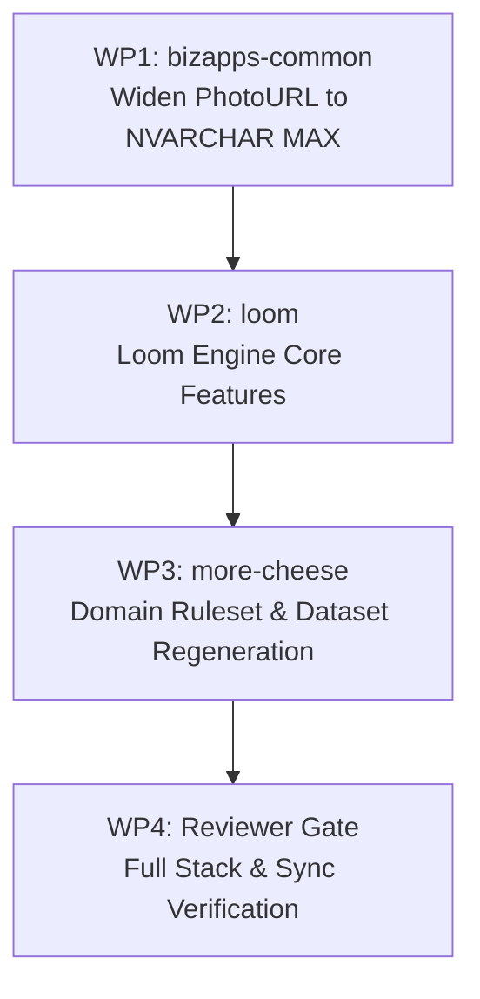

# Loom Plan 07: Correlated Value Generation, Coherent Order Reversals, and Avatar Strategy

**Repository**: `MemberJunction/loom` (Plan of Record)  
**Downstream Repositories**: `MemberJunction/more-cheese`, `MemberJunction/bizapps-common`  
**Status**: Proposal for Review  
**Target Milestone**: September 2026 Release Alignment  

---

## 1. Executive Summary & Problem Statement

During full-scale validation of the 120,000-record `more-cheese` world model across the joined MemberJunction stack, four systemic data defects and visual constraints were identified:

1. **Gender / Name / Prefix / Pronoun Incoherence**:
   - `Person.Prefix` vs `Person.Gender` is a 51% coin flip (973 of 1,910 prefix assignments conflict with Gender, e.g. *"Mrs. Marcus Chen"*, *"Mr. Elena"*).
   - `MemberProfile.PronounSet` vs `Person.Gender` is a 50.8% coin flip (400 of 788 conflict, e.g. *"he/him"* on Female records).
   - `Person.FirstName` and `Person.Gender` are drawn independently, producing a 47% mismatch on gendered names.
2. **Independent Age / Join Date Draws**:
   - 48 members joined before age 18, with the youngest at age 9.5 (Nadia Ivanov, DOB 2003-11-01, joined 2013-05-10).
   - `DateOfBirth` was drawn independently of the entity's intake cycle / join date.
3. **Incoherent Order Cancellations & Sign Reversals**:
   - Out of 218 cancellations in the dataset, only 24 are coherent.
   - 114 share no products with what they reverse, 185 differ in amount, 23 reverse an order dated *after* the cancellation, 16 originals are reversed multiple times, 2 reverse someone else's order, and 6 reverse a Voided or Draft order.
   - Crucially, cancellations were generated with positive `TotalGross` and positive line quantities, adding +$52,310 to sales instead of netting them out.
4. **Avatar Visual Fidelity and Combinatorial Collapse**:
   - Current hand-drawn SVGs (`AvatarGenerator.BuildSvg`) were strictly constrained to 700 bytes to fit under `NVARCHAR(1000)`.
   - The limited part library produces winking expressions and unnatural hairstyles, collapsing 3,058 people onto only 1,501 distinct avatars.

### Core Architecture Principle: Generalized Loom Primitives
Loom must remain a **general-purpose synthetic data engine**. It must **not** hardcode English names, specific gender rules, or association-specific logic into its core algorithms. Instead, Loom will provide generalized declarative primitives in `contracts` and `engine`:
1. **Generic Conditional Distributions & Multi-attribute Mapping Catalogs**
2. **Correlated Value Ranges & Relative Date Bounds**
3. **Contract-Aware Reversal / Cancellation Unrolling**
4. **Flexible Avatar Generation (Deterministic URL Mode & Offline Data URI Mode)**

---

## 2. Loom Engine Architecture Enhancements

### 2.1 Generic Conditional Distributions & Catalog Lookups

Loom expands `FieldConfigSchema` in `@memberjunction/loom-contracts` to support declarative conditional draws.

#### Declarative Schema (`packages/contracts/src/domain.ts`)

```typescript
export const ConditionalDistributionSchema = z.object({
  type: z.literal('conditionalDistribution'),
  conditionalOn: z.string().min(1), // e.g. "Gender" or "parent.Gender"
  distributions: z.record(
    z.string(),
    z.object({
      values: z.array(z.union([z.string(), z.number(), z.boolean(), z.null()])),
      weights: z.array(z.number().positive()).optional(),
    })
  ),
});

export const CatalogLookupSchema = z.object({
  type: z.literal('catalogLookup'),
  catalog: z.string().min(1), // references a catalog declared under data/catalogs/<name>.json
  conditionalOn: z.string().optional(), // key in catalog, e.g. "Gender"
  mappingKey: z.record(z.string(), z.string()).optional(), // maps row value to catalog bucket
});
```

#### Application in Domain Config (`more-cheese/data/domain.json`)

```jsonc
"Person": {
  "fields": {
    "Gender": {
      "type": "string",
      "values": ["Female", "Male", "NonBinary"],
      "weights": [0.49, 0.49, 0.02]
    },
    "FirstName": {
      "type": "string",
      "generator": {
        "type": "catalogLookup",
        "catalog": "given-names",
        "conditionalOn": "Gender",
        "mappingKey": {
          "Female": "female",
          "Male": "male",
          "NonBinary": "unisex"
        }
      }
    },
    "Prefix": {
      "type": "string",
      "nullable": true,
      "generator": {
        "type": "conditionalDistribution",
        "conditionalOn": "Gender",
        "distributions": {
          "Female": { "values": ["Ms.", "Dr.", "Mrs.", null], "weights": [0.55, 0.15, 0.25, 0.05] },
          "Male": { "values": ["Mr.", "Dr.", null], "weights": [0.75, 0.15, 0.10] },
          "NonBinary": { "values": ["Mx.", "Dr.", null], "weights": [0.60, 0.20, 0.20] }
        }
      }
    }
  }
}
```

#### Cross-Entity Resolution (`MemberProfile.PronounSet`)
Using Loom's existing parent scope resolution `${parent.Field}`, child entities resolve values from parent FK rows:

```jsonc
"MemberProfile": {
  "fields": {
    "PronounSet": {
      "type": "string",
      "nullable": true,
      "generator": {
        "type": "conditionalDistribution",
        "conditionalOn": "parent.Gender",
        "distributions": {
          "Female": { "values": ["she/her", "they/them"], "weights": [0.96, 0.04] },
          "Male": { "values": ["he/him", "they/them"], "weights": [0.96, 0.04] },
          "NonBinary": { "values": ["they/them", "she/they", "he/they"], "weights": [0.85, 0.08, 0.07] }
        }
      }
    }
  }
}
```

---

### 2.2 Correlated Value Ranges & Relative Date Bounds

To eliminate demographic anomalies (e.g. child members in an adult professional association), Loom adds relative range constraints to date and numerical generators.

#### Declarative Schema (`packages/contracts/src/domain.ts`)

```typescript
export const RelativeDateRangeSchema = z.object({
  relativeTo: z.enum(['intakeDate', 'asOfDate', 'parentDateField', 'now']),
  anchorField: z.string().optional(),
  minOffsetYears: z.number().optional(), // e.g. -75
  maxOffsetYears: z.number().optional(), // e.g. -18 (ensures age >= 18 at intake)
  distribution: z.enum(['uniform', 'normal']).default('normal'),
  meanOffsetYears: z.number().optional(), // e.g. -42
  stdDevYears: z.number().optional(),     // e.g. 12
});
```

#### Engine Behavior (`packages/cli/src/generation.ts`)
- When unrolling `Person`:
  1. Determine the person's earliest simulation activity date $T_{anchor}$ (e.g. earliest `MembershipPeriod.StartDate` or initial cycle intake date).
  2. Draw `DateOfBirth` strictly bounded by:
     $$\text{DOB} \in [T_{anchor} + \text{minOffsetYears}, T_{anchor} + \text{maxOffsetYears}]$$
     With $\text{maxOffsetYears} = -18$, every member is guaranteed to be at least 18.0 years old on the date they join the association.
  3. The normal distribution centered at $-42$ years provides a realistic median member age of 42 at join time, spanning 18 to 75.

---

### 2.3 Coherent Order Cancellation & Line Reversals Engine

MemberJunction's accounting and order framework (`@mj-biz-apps/orders-core-entities-server`) establishes strict lifecycle and arithmetic rules for order cancellations (`ReversalBehavior.ts`). Loom's simulation unroller must model these semantics faithfully.

#### Reversal Invariants in Loom Simulation
1. **Target Selection**:
   - `OriginalOrder.OrderType === 'Sale'`
   - `OriginalOrder.Status === 'Confirmed'` (never Draft, Quoted, or Voided)
   - `OriginalOrder.OrderDate <= CancellationOrder.OrderDate`
   - `OriginalOrder.BillToPersonID === CancellationOrder.BillToPersonID` (same customer)
   - `OriginalOrder.ReversedByOrderHeaderID IS NULL` (strictly 1:1, no double-reversals)
2. **Line Mirroring & Negative Arithmetic**:
   - For each line in the original order (or returned subset):
     - `ReversalLine.ReversesOrderLineID = OriginalLine.ID`
     - `ReversalLine.ProductID = OriginalLine.ProductID` (exact product match)
     - `ReversalLine.Quantity = -1 * OriginalLine.Quantity` (negative quantity)
     - `ReversalLine.UnitPrice = OriginalLine.UnitPrice` (refunds historical price paid)
     - `ReversalLine.LineTotalNet = -1 * OriginalLine.LineTotalNet`
     - `ReversalLine.LineTotalGross = -1 * OriginalLine.LineTotalGross`
3. **Financial Rollup**:
   - `CancellationOrder.TotalGross` is negative (e.g. `-$150.00`).
   - `CancellationOrder.AmountPaid` is `-$150.00` (refunded), leaving `Balance = $0.00`.
   - Total organization gross properly nets out the return, correcting the financial reporting defect.

---

## 3. Avatar & Image Generation Strategy

### 3.1 Analysis of Options

| Dimension | Option A: DiceBear URL Mode (Immediate) | Option B: DiceBear Offline Base64 (Plan 06) | Option C: Tweak Hand-Drawn SVG |
| :--- | :--- | :--- | :--- |
| **Visual Quality** | **Modern vector illustration** (`toon-head` / `micah`). No winking, natural hair. | **Identical to Option A** (`toon-head` / `micah`). | Flat geometric shapes; improved over today but still primitive. |
| **Schema Impact** | **Zero**. Fits in `NVARCHAR(1000)`. | Requires `NVARCHAR(MAX)` on `PhotoURL`/`LogoURL` (`bizapps-common`). | **Zero**. Fits in `NVARCHAR(1000)`. |
| **Payload Size** | ~120 characters per row. Zero JSON / SQL bloat. | ~6.8 KB per row (+21 MB across 3,058 people). | ~700 bytes per row. |
| **Offline Operation** | Requires internet access in Explorer. | 100% offline, airgapped, zero external requests. | 100% offline. |
| **Distinctness** | **3,058 / 3,058 distinct**. | **3,058 / 3,058 distinct**. | ~2,500 / 3,058 distinct. |
| **Licensing** | MIT (code) + CC BY 4.0 / CC0 (art). | MIT (code) + CC BY 4.0 / CC0 (art). | Custom MIT. |

### 3.2 URL Determinism & Stability on DiceBear CDN

DiceBear's HTTP API is **100% deterministic and stateless**:
- **Format**: `https://api.dicebear.com/9.x/{style}/svg?seed={seed}`
- **Determinism Guarantee**: DiceBear uses a seeded PRNG (`prando`). For any given style and version (e.g. `9.x`), passing the same `seed` string produces the exact same SVG output every single time across any machine or browser.
- **Parametric Traits**: Query parameters can deterministically constrain traits (e.g. gender-appropriate hair):
  `https://api.dicebear.com/9.x/toon-head/svg?seed={PersonID}&gender=female`

#### Live Interactive Examples (Click to inspect in browser):
1. **`toon-head` (Default Candidate — Modern Illustrated Headshots)**:
   - [Elena (Female)](https://api.dicebear.com/9.x/toon-head/svg?seed=Elena-Vasquez&gender=female)
   - [Marcus (Male)](https://api.dicebear.com/9.x/toon-head/svg?seed=Marcus-Chen&gender=male)
   - [Gwen (Female)](https://api.dicebear.com/9.x/toon-head/svg?seed=Gwen-Stirling&gender=female)
2. **`micah` (Alternate Candidate — Artistic Minimalist Vector)**:
   - [Elena (Micah)](https://api.dicebear.com/9.x/micah/svg?seed=Elena-Vasquez)
   - [Marcus (Micah)](https://api.dicebear.com/9.x/micah/svg?seed=Marcus-Chen)
3. **`personas` (Clean Corporate Character Vector)**:
   - [Elena (Personas)](https://api.dicebear.com/9.x/personas/svg?seed=Elena-Vasquez)
   - [Marcus (Personas)](https://api.dicebear.com/9.x/personas/svg?seed=Marcus-Chen)

### 3.3 Phased Implementation Roadmap
- **Phase 1 (Immediate / Thursday Release Cut)**:
  - Configure `Person.PhotoURL.avatar` with `format: "url"` and `style: "toon-head"` in `more-cheese/data/domain.json`.
  - Instantly resolves winking icons and odd hair.
  - Zero database migration required; keeps the metadata push lightweight.
- **Phase 2 (Permanent Infrastructure — Post-Release)**:
  - Execute WP1 in `bizapps-common` (widening `PhotoURL` to `NVARCHAR(MAX)`).
  - Transition Loom's `AvatarGenerator` to offline data URI rendering (`format: "base64"` with `svgo` minification) for full airgapped deployment guarantees.

---

## 4. Automated Quality & Validation Gates

Loom's validation suite (`npm run validate:loom`) and mutation test suite (`npm run test:loom-mutations`) will enforce these invariants:

1. **`Name-Gender Consistency Gate`**:
   - Compares `FirstName` against gendered catalog entries. Fails if mismatch rate exceeds 0% on recognized names.
2. **`Prefix-Gender Consistency Gate`**:
   - Asserts that male prefixes (`Mr.`) never attach to `Female` persons, and female prefixes (`Ms.`, `Mrs.`) never attach to `Male` persons.
3. **`Pronoun-Gender Consistency Gate`**:
   - Asserts that `he/him` never attaches to `Female` and `she/her` never attaches to `Male`.
4. **`Minimum Age at Intake Gate`**:
   - Asserts that for every person, $\text{JoinDate} - \text{DateOfBirth} \ge 18.0\text{ years}$.
5. **`Reversal Coherence Gate`**:
   - Asserts 100% coherence on order cancellations (prior order date, same customer, matching products, negative quantities, negative gross).
6. **`Avatar Uniqueness Gate`**:
   - Asserts that 100% of generated avatars (3,058 of 3,058) are unique.

---

## 5. Work Packages & Implementation Order



### WP1: `MemberJunction/bizapps-common`
- New V migration: `ALTER TABLE __mj_BizAppsCommon.Person ALTER COLUMN PhotoURL NVARCHAR(MAX) NULL;`
- Same for `Organization.LogoURL`.
- CodeGen regeneration and changeset.

### WP2: `MemberJunction/loom`
- Implement `conditionalDistribution` and `catalogLookup` in `loom-contracts` and `loom-engine`.
- Implement `relativeTo` date range calculations in `generation.ts`.
- Implement coherent cancellation generator in `build.ts`.
- Add DiceBear adapter with `url` and `base64` modes.
- Implement the 6 automated validation gates in `validate.ts`.

### WP3: `MemberJunction/more-cheese`
- Declare gender catalog and conditional distributions for `Prefix` and `PronounSet`.
- Declare `minOffsetYears: -18` on `Person.DateOfBirth`.
- Set `Person.PhotoURL` to `toon-head`.
- Run single deterministic regeneration (`npm run generate`).
- Verify all gates: `check:ownership`, `validate:loom`, `test:loom-mutations`, and `check-metadata-closure.mjs`.

### WP4: Reviewer Gate & Release Sign-off
- Clean-checkout verification of zero orphaned FKs, 100% passing gates, and zero negative-sales distortions.
