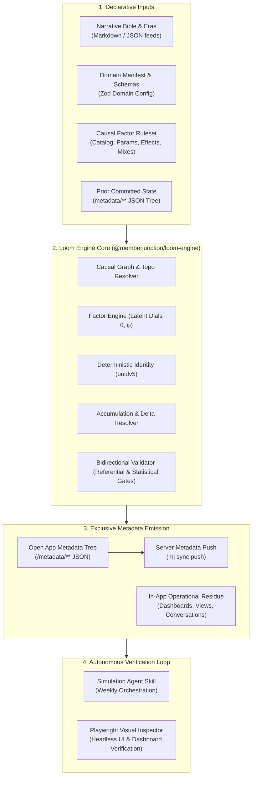
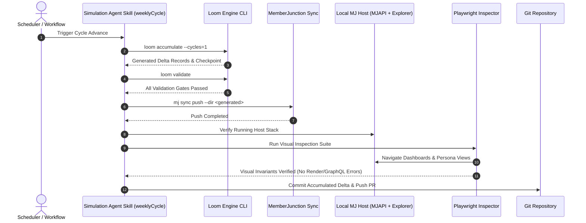

# Loom: Architecture & Implementation Plan

**Deterministic, Causal Business World & Data Simulation Engine for MemberJunction**

Version 1.0 · September 2026  
Status: Approved Architectural Roadmap  
Target Repository: `MemberJunction/loom`  
Flagship Consumer: `MemberJunction/more-cheese`

---

## 1. Executive Summary & Core Philosophy

### 1.1 Why Loom Exists
Enterprise software demonstrations and integration test fixtures almost invariably fail the **realism test**. Conventional synthetic data generation relies on independent sampling across columns: pulling a name from a census list, an address from a postal file, an order total from a log-normal distribution, and a renewal flag from a coin flip. The resulting database satisfies simple schema constraints, but promptly collapses under analytical examination:
- Street names that do not exist in the listed municipality.
- High churn among customers who show daily platform logins.
- Support tickets and billing dispute threads opened simultaneously with payments.
- Total absence of operational residue: zero audit logs, empty saved views, no notifications, and no shared history.
- Brittle, stateless wipe-and-reseed cycles that break external references and produce massive 100MB+ SQL migration snapshots.

**Realism is not a property of plausible independent distributions. Realism is a property of causality, correlation, and continuous accumulation.**

### 1.2 The Core Premise: Causality First, Not Sampling
In Loom, no observable business record is minted in isolation:
1. **Underlying Dials**: Every participant in the world carries hidden, continuous latent variables (e.g., Engagement $\theta$, Affluence $\phi$, Risk Tolerance $\psi$, Market Headwinds $\omega$).
2. **Causal Factors**: Observable behaviors (attending a conference, renewing membership, disputing an invoice, submitting a support ticket) descend directly from these dials through explicitly declared **Factor Contracts**.
3. **Emergent Correlation**: Slice the resulting dataset across any dimension—financial, operational, or governance—and authentic correlations emerge naturally because they are downstream consequences of shared causes, not painted surface decorations.

### 1.3 The Core Shift: First-Class Accumulation
Real organizations do not drop their database and re-seed every quarter; they accumulate operational history over years. 
- Loom treats accumulation as a first-class engine primitive:
  $$\text{Loom: } (\text{domainConfig}, \text{seed}, \text{releaseDate}, \text{ruleset}, \text{priorState}) \longrightarrow \text{deltaRecords}$$
- Each simulation cycle ingests the committed prior state (`metadata/` JSON tree), respects continuity boundaries (active committee terms, open billing tickets, pending renewal grace periods), and emits **only new records**.
- Every delta is naturally a pure, additive MemberJunction metadata sync diff, ingested via `mj sync push`.

### 1.4 Canonical Engine Invariants
The Loom simulation engine strictly preserves seven architectural invariants across all packages, seeds, and execution modes:
- **Invariant 1 (Deterministic Identity)**: Primary keys are derived deterministically via `IdentityService.MintId(domain, entity, businessKeys)` (uuidv5). Identical business key values yield the exact same UUID across all cycles and seeds.
- **Invariant 2 (No Unseeded Dice)**: Generation is 100% deterministic and reproducible. Personal pseudo-random streams are keyed via `seed:entity:id:cycle`.
- **Invariant 3 (No Index Overwriting)**: Heroes are additive records minted from business keys, never index overwrites of crowd slots. Adding or removing a hero changes no other generated record in the dataset.
- **Invariant 4 (The LLM Boundary)**: Runtime simulation is strictly zero-LLM math. LLM capabilities are confined entirely to an authoring-time companion package (`@memberjunction/loom-author`) that outputs validated JSON metadata.
- **Invariant 5 (Deep Immutability)**: Emitted transaction history from earlier cycles is never mutated in subsequent cycles.
- **Invariant 6 (Factor Recovery)**: Statistical logistic regression over emitted crowd data recovers authored $\beta$ weights within defined tolerance bounds ($\pm 0.15$ at $N \ge 5000$).
- **Invariant 7 (Topological & Referential Closure)**: Emitted datasets strictly preserve foreign key closure in topological DAG dependency order with zero orphaned records.
- **Invariant 8 (Metadata Sole Delivery)**: Metadata is the sole engine for synthetic data delivery. All simulated records are emitted as partitioned declarative metadata files (`metadata/` tree) and ingested exclusively via MemberJunction's metadata sync push (`mj sync push`) through server metadata APIs. Direct SQL `INSERT` bypasses are strictly prohibited.

---

## 2. Re-architecting Loom: From Procedural Script to Metadata Engine

The legacy generation approach in More Cheese (`datagen/`) proved the statistical principles of causality, factor contracts, and deterministic seeds. However, it suffered from structural limitations:
- Procedural generation scripts tightly coupled to association-specific entities.
- Fragile stringly-typed table maps and manual schema conversions.
- Stateless execution that forced brittle 122,000-row SQL snapshot captures.

**In Loom, we gut and rebuild the engine core to be 100% metadata-driven, fully configuration-based, and vastly more flexible:**



---

## 3. Monorepo Structure & Package Boundaries

Loom is organized as a pnpm monorepo governed by Turborepo:

```
loom/
├── packages/
│   ├── contracts/            # @memberjunction/loom-contracts
│   │   ├── src/
│   │   │   ├── domain.ts     # Domain manifest & entity configuration schemas
│   │   │   ├── factors.ts    # Factor contract types { effect, feature, evidence }
│   │   │   ├── ruleset.ts    # Ruleset module schemas (catalog, params, effects, mixes)
│   │   │   ├── state.ts      # Prior state, continuity state, and delta schemas
│   │   │   └── index.ts
│   │   └── package.json
│   │
│   ├── engine/               # @memberjunction/loom-engine
│   │   ├── src/
│   │   │   ├── graph/        # Causal dependency graph & topological sorter
│   │   │   ├── factors/      # Latent dial generator and factor evaluator
│   │   │   ├── identity/     # Deterministic uuidv5 namespace management
│   │   │   ├── accumulation/ # Prior state diffing and delta calculation
│   │   │   ├── validation/   # Bidirectional factor and referential gate engine
│   │   │   ├── emitters/     # MetadataSync JSON emitters
│   │   │   └── index.ts
│   │   └── package.json
│   │
│   ├── cli/                  # @memberjunction/loom-cli
│   │   ├── src/
│   │   │   ├── commands/     # build, accumulate, validate, emit
│   │   │   ├── bin/loom.ts   # Executable CLI entrypoint
│   │   │   └── index.ts
│   │   └── package.json
│   │
│   └── agent-skill/          # @memberjunction/loom-agent-skill
│       ├── src/
│       │   ├── workflows/    # Weekly simulation cycle orchestration
│       │   ├── playwright/   # Browser visual verification scripts
│       │   ├── quality/      # LLM-bound narrative and data consistency checks
│       │   └── index.ts
│       └── package.json
│
├── projects/
│   ├── fixture/              # Lightweight CI testbed project (~120 lines, verified every build)
│   ├── enterprise/           # Reference enterprise SaaS simulation project
│   └── governance-fixture/   # Generic governance and temporal scoping fixture
│
├── docs/                     # Architecture specs, factor contract guide, CLI manual
├── plans/                    # Active implementation briefs and design roadmap
├── .github/workflows/        # CI: suite execution (validation gates + fixture build)
├── package.json              # Monorepo root
├── turbo.json                # Turborepo task pipeline
└── tsconfig.json             # Root strict TypeScript configuration
```

---

## 4. Key Subsystems & Design Specifications

### 4.1 `@memberjunction/loom-contracts`
Defines the strict type contracts and Zod runtime schemas for all Loom inputs and outputs:
- **`DomainConfig`**: Declares entities, primary business keys, foreign key edges, target schemas, and lifecycle states.
- **`FactorContract`**: Formally specifies causal relations:
  ```typescript
  export interface FactorContract<TFeature = unknown> {
    effect: string;
    feature: TFeature;
    evidence: {
      source: string;
      confidence: "high" | "medium" | "low" | "estimate";
      notes: string;
    };
    target: number;
    tolerance: number;
  }
  ```
- **`ContinuityState`**: Captures active committee terms, open dispute tickets, pending membership renewals, and active customer payment tokens required to bridge simulation cycles.

### 4.2 `@memberjunction/loom-engine`
The execution engine:
1. **Graph Resolution**: Evaluates entity and factor dependencies into a strict Directed Acyclic Graph (DAG):
   $$\text{Macro World} \longrightarrow \text{Parties (Orgs/People)} \longrightarrow \text{Dials} \longrightarrow \text{Committees/Roles} \longrightarrow \text{Events/Orders} \longrightarrow \text{Accounting JEs}$$
2. **Latent Dials**: Generates personal anchors and persistent random walks for $\theta$ (engagement) and $\phi$ (affluence).
3. **Accumulator**: Evaluates `currentWorld - priorState = deltaRecords`. Validates that existing IDs are never reassigned and that existing immutable records (confirmed orders, executed legal contracts) are never modified.
4. **Validator**: Derives verification gates from declarations. Verifies:
   - Referential closure (zero dangling UUIDs).
   - CHECK constraint compliance across all target schemas.
   - Tolerance bands for factor contracts.

### 4.3 Direct BizApps Suite Integration
Loom natively targets the solid BizApps schemas in the MemberJunction ecosystem:
- **`bizapps-common` (`__mj_BizAppsCommon`)**: 
  Generates `Person`, `Organization`, `Address`, `ContactMethod`, `Relationship`, and unified chronological `Activity` records.
- **`bizapps-orders` (`__mj_BizAppsOrders`)**: 
  Generates commercial transactions directly into real order tables: `Product`, `PriceBook`, `OrderHeader`, `OrderLine`, `CustomerPaymentMethod`, `Payment`, and `Subscription`.
- **`bizapps-accounting` (`__mj_BizAppsAccounting`)**: 
  Emits balanced subsidiary ledger journal entries per order line (`OrderLine.JournalEntryID`), stages ratable revenue recognition entries (`Dr Deferred Revenue / Cr Sales Revenue`), and resolves GL accounts by role.
- **`bizapps-tasks` & `bizapps-issues`**: 
  Spawns committee action items, renewal outreach tasks, and customer support tickets with authentic lifecycle state transitions.
- **`bizapps-secure-messaging`**: 
  Constructs customer portal support threads and message exchanges derived directly from issue state transitions.

### 4.4 In-App Artifacts & Metadata Workflow
Loom codifies the clean separation between causal data generation and in-app operational residue:
- **No Synthetic JSON Guesswork**: In-app artifacts (Explorer dashboards, saved query views, agent conversation histories, pinned lists) are created natively in the UI by demo authors and personas.
- **`mj sync pull` Extraction**: Running `mj sync pull` captures those live database records into `/metadata/**`.
- **Declarative Metadata Delivery**: The committed metadata files are pushed directly through MemberJunction `MetadataSync` (`mj sync push`). Direct SQL data migrations are superseded by Invariant 8.

---

## 5. The Simulation Agent Skill with Playwright

Loom introduces an autonomous **Agent Skill** (`weeklyCycle`) to automate recurring simulation cycles:



### Key Playwright Verification Invariants:
1. **Dashboard Health**: Verifies that dashboard cards, KPI gauges, and chart components load and render with non-zero, valid values.
2. **Persona Authenticity**: Logs in as key personas (e.g. CEO, VP Membership) to ensure user-scoped views, notifications, and conversation histories are intact.
3. **Zero Console & GraphQL Errors**: Listens for network error responses (`errors` field in GraphQL responses) or uncaught console exceptions during navigation.

---

## 6. Implementation Roadmap & Sequencing

### Phase 1: Monorepo & Contracts Foundation
- [x] Initialize monorepo workspace configuration (`pnpm-workspace.yaml`, `package.json`, `turbo.json`, `tsconfig.json`).
- [x] Implement `@memberjunction/loom-contracts` with complete Zod schemas for domain configurations, factors, and rulesets.
- [x] Implement `projects/fixture` as the baseline CI project.
- [x] Setup GitHub Actions workflow running monorepo build, lint, and typecheck.

### Phase 2: Core Engine Rebuild (`@memberjunction/loom-engine`)
- [x] Implement `CausalGraphResolver` (topological dependency sorter).
- [x] Implement `FactorEngine` (latent dial generation via Cholesky decomposition and factor contract evaluation).
- [x] Implement `IdentityService` (deterministic `uuidv5` namespace registration).
- [x] Implement `Validator` (referential closure and empirical factor tolerance evaluation).
- [x] Implement MetadataSync emitter (`metadata/` JSON tree with `.mj-sync.json` and `{ primaryKey, fields }` record wrappers; SQL emitter superseded by Invariant 8).

### Phase 3: The `loom` CLI (`@memberjunction/loom-cli`)
- [x] Implement `loom build` (full baseline generation).
- [x] Implement `loom validate` (comprehensive gate execution with Invariant 7).
- [x] Interactive inspection via structured CLI logs, validator reports, and Playwright verification (standalone inspect CLI dropped in favor of declarative logging).
- [x] Wire CLI into monorepo and verify end-to-end execution against `projects/fixture`.

### Phase 4: Accumulation Engine & Delta Resolver
- [x] Implement stateful prior-state reader and continuity boundary tracker (`Accumulator`).
- [x] Implement `loom accumulate` CLI command.
- [x] Implement delta resolver updating metadata records in place via differential status updates (SQL spCreate migrations superseded by Invariant 8).
- [x] Verify multi-cycle accumulation on `projects/fixture`.

### Phase 5: More Cheese Migration to Loom (Measured Reality)
- [x] Define More Cheese domain manifest (`data/domain.json`) and factor rulesets in Loom.
- [x] Direct generation targeting standard BizApps/Core schemas (`generated/` metadata trees partitioned per entity).
- [x] Schema & Directory Ownership manifest (`data/ownership.json`): Measured reality at cheese #27 `0ae53cd`: 10 `loom`, 44 `frozen`, 11 `config`.
- [x] Referential closure and schema integrity: 9 closure invariants (FK closure, directoryOrder completeness, PK uniqueness, TotalGross balance, balance identity, no overpayment, period-to-order 1:1 within 90 days, DuesAmount equals UnitPrice, status shape by category).
- [x] Relational integrity gates: Relational rules evaluated on generic test fixtures (`projects/governance-fixture/`); cheese #26 consolidated production More Cheese rules into closure invariants.
- [x] Accumulation and checkpoint persistence: deterministic multi-cycle advancement from prior state via `checkpoint.json`.
- [x] Elimination of Direct SQL Bypasses: all synthetic data emitted as partitioned declarative metadata files ingested via `mj sync push`.

### Phase 6: Simulation Agent Skill & First-Class Cadence
- [x] Implement the Simulation Agent Skill package (`@memberjunction/loom-agent-skill`).
- [x] Implement `weeklyCycle` orchestrator executing strict pipeline: Accumulate (`loom accumulate --cycles <n>`) -> Validate (`loom validate`) -> Push (`mj sync push --dir <generated>`) -> Visual verification (Playwright).
- [x] First-class cadence abstraction (L10-6): `cycleUnit` supporting `day` | `week` | `month` | `year`; `--cycles <n>` CLI option replacing `--weeks`; calendar-correct month advances across 31-day, leap-year, and month-end boundaries.
- [x] Implement Playwright visual inspection scripts for MJExplorer dashboards and persona views (`@memberjunction/loom-agent-skill/src/playwright`).
- [ ] Configure recurring GitHub Actions workflow / cron runner for automated simulation advances.

---

## 7. Iterative Authoring & Counterfactual Branching

### 7.1 Iterative Authoring Workflow
Real-world enterprise world authoring is never done in a single monolithic "one-shot" pass. Attempting to author an entire year's worth of complex causal rules, hero arcs, and edge cases at once produces noisy, uncalibrated datasets where bugs compound.
Instead, Loom enforces an **iterative authoring discipline**:
1. **Baseline Inception**: The author starts with structural entities, core identities (`Person`, `Organization`), and baseline demographic distributions.
2. **Layering Narrative Boundaries**: Eras (`eras.json`) and Hero rosters (`heroes.json`) are introduced to define macroeconomic phases and key character arcs.
3. **Factor & Pattern Layering**: Causal factors (`ruleset/common.json`), nested events, and temporal role patterns are layered incrementally over single cycles, verifying with `loom validate` at each step.
4. **Continuity & Accumulation**: Once baseline cycles pass all validation gates, the author advances simulation via `loom accumulate --cycles 1`, observing emergent downstream behaviors without mutating prior state.

### 7.2 Counterfactual Branching & Signature Isolation
Loom's deterministic architecture enables precise **counterfactual branching**: running "what-if" organizational simulations from identical starting conditions by varying a single factor or ruleset parameter.

**Signature Isolation Assessment**:
The execution signature tuple `(project, seed, release, ruleset)` cleanly and completely isolates causal mutations:
- Because PRNG sequences are deterministically keyed per `seed:entity:id:cycle`, altering a factor parameter on one entity leaves unrelated entities and upstream generators entirely untouched.
- **Tooling Gap Identified**: While raw `diff -u -r` proves physical isolation, dedicated CLI tooling (`loom diff --baseline <dir> --variant <dir>`) is planned to summarize causal divergences in business terms (e.g. "Factor target shift 0.80 -> 0.40 resulted in -40% renewal rate across members with zero referential drift").

---

*Loom is developed as core MemberJunction infrastructure under the Business Source License 1.1 (BUSL-1.1).*
